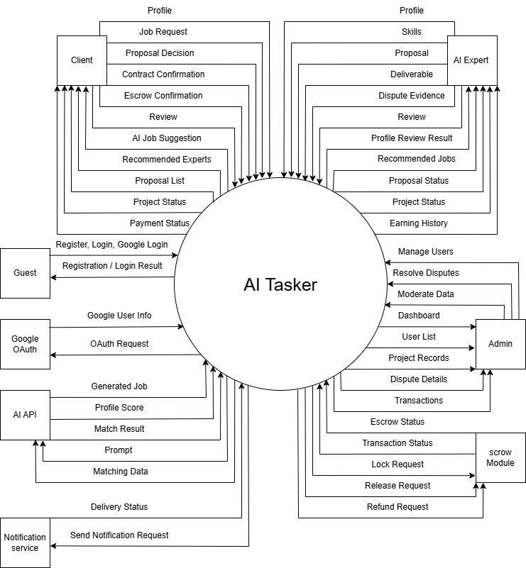
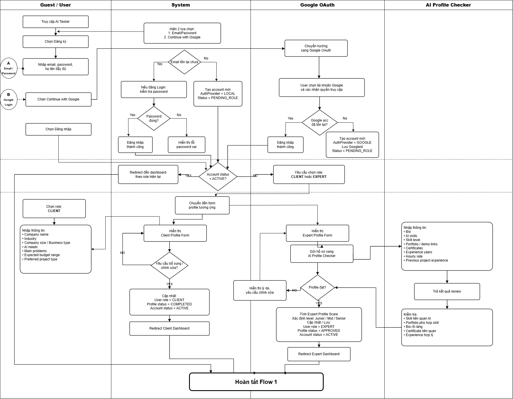
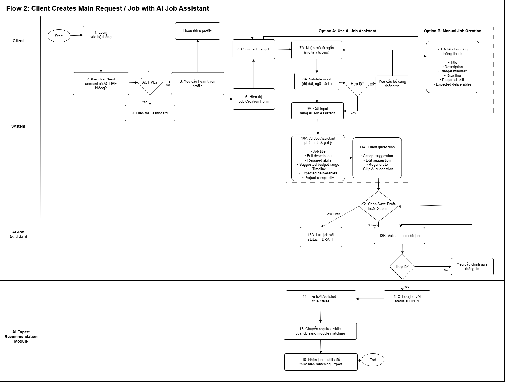
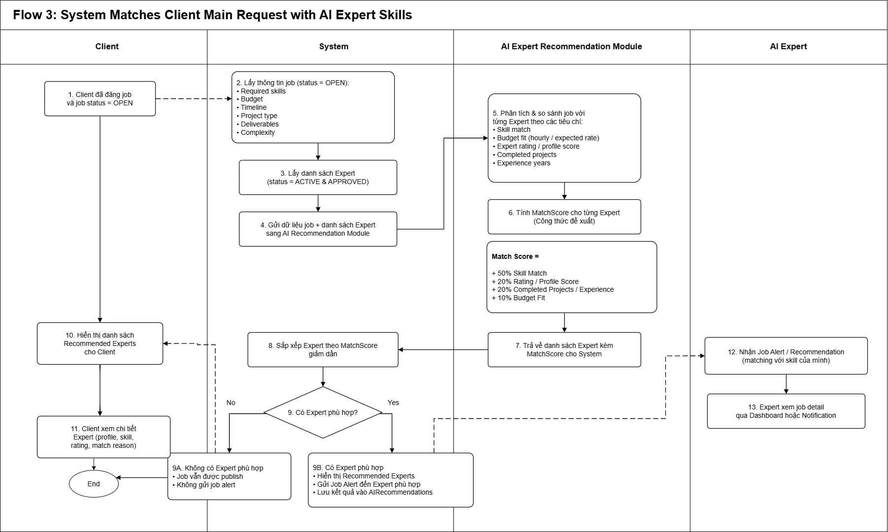
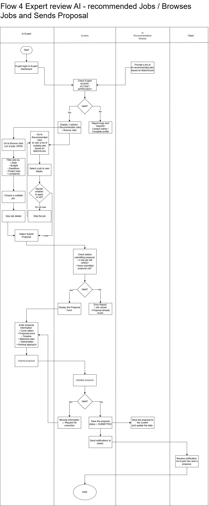
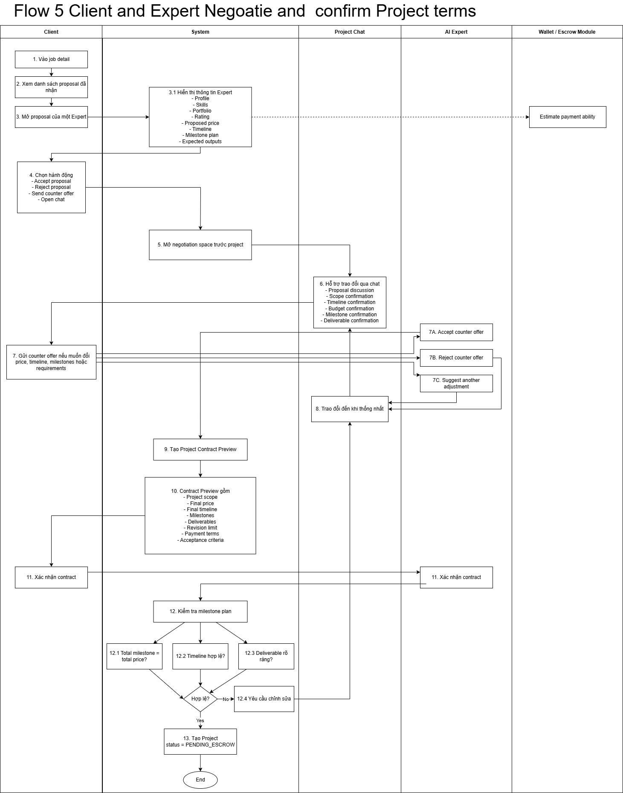
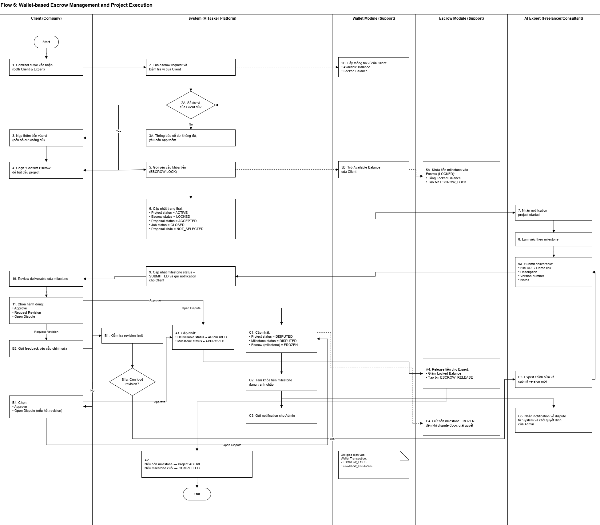
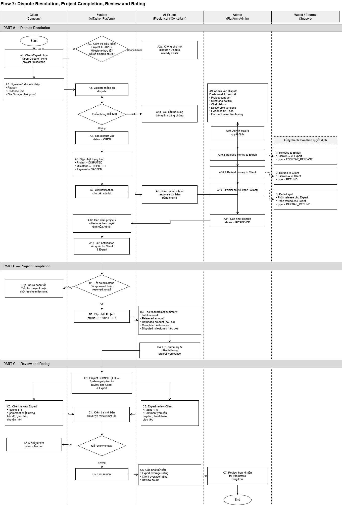

# AITasker — AI Marketplace Platform for AI Automation Services
---

# 1. Bối cảnh thực hiện đề tài

## 1.1 Background

In recent years, AI adoption has increased rapidly in businesses, especially among startups, small companies, and non-technical users. However, they often face difficulties in defining AI project requirements, finding suitable AI experts, and ensuring trust in project delivery and payment. Therefore, AITasker is proposed as a specialized AI marketplace that connects Clients with AI Experts through AI-assisted job creation, expert matching, project management, escrow, and review.

---

## 1.2 Problem Statement

| Đối tượng | Vấn đề |
|---|---|
| Client | Không biết viết AI project requirement rõ ràng |
| Client | Khó tìm đúng AI Expert phù hợp với job |
| Client | Khó so sánh proposal, timeline, budget và deliverables |
| Client | Không có nơi trao đổi và xác nhận rõ scope, output, timeline trước khi bắt đầu |
| Client | Lo ngại rủi ro thanh toán, deadline và chất lượng sản phẩm |
| AI Expert | Khó tìm đúng job AI phù hợp với skill |
| AI Expert | Khó chứng minh năng lực AI qua profile, portfolio và proposal |
| AI Expert | Cần nơi để gửi proposal có timeline, outputs, budget và milestone rõ ràng |
| AI Expert | Lo ngại không được thanh toán sau khi giao sản phẩm |
| Admin | Cần quản lý users, jobs, proposals, projects, escrow, disputes và reviews |

Tóm lại, vấn đề chính của đề tài là: **làm sao để Client có thể mô tả nhu cầu AI rõ hơn, tìm đúng AI Expert hơn, và đảm bảo quá trình thuê — làm việc — thanh toán diễn ra minh bạch hơn.**

---

## 1.3 Proposed Solution

AITasker là một **AI-specialized freelance marketplace** theo mô hình chính giống Upwork.

Hệ thống giải quyết vấn đề bằng cách:

1. Cho phép người dùng đăng ký/đăng nhập bằng email/password hoặc Google.
2. Tách profile form của **Client** và **AI Expert** để xác thực đúng đặc điểm từng role.
3. Dùng **AI Profile Checker** để kiểm tra hồ sơ Expert, skill, portfolio và certificate.
4. Hỗ trợ Client tạo AI job rõ ràng bằng **AI Job Assistant**.
5. Dùng **AI Expert Recommendation Module** để match job requirements với Expert skills/profile.
6. Cho phép Expert nhận **recommended jobs** hoặc tự **browse jobs** truyền thống.
7. Cho phép Expert gửi proposal có:
   - Cover letter
   - Proposed price
   - Proposed timeline
   - Milestone plan
   - Expected outputs/deliverables
   - Working approach
8. Cho phép Client và Expert trao đổi, thương lượng, xác nhận:
   - Scope
   - Timeline
   - Budget
   - Milestones
   - Deliverables
   - Acceptance criteria
9. Quản lý payment bằng **wallet-based escrow**.
10. Quản lý project execution theo milestone.
11. Chỉ release tiền cho Expert khi Client approve deliverable.
12. Hỗ trợ dispute resolution nếu có tranh chấp.
13. Cho phép hai bên review và rating sau khi project hoàn thành.

### Định hướng mô hình

| Yếu tố | AITasker xử lý như thế nào |
|---|---|
| Client có nhu cầu AI | Đăng AI request/job |
| Client không biết viết requirement | AI Job Assistant hỗ trợ tạo job description |
| Khó tìm Expert phù hợp | AI Expert Recommendation match job với Expert skills |
| Expert muốn tìm job | Recommended Jobs hoặc Browse Jobs |
| Hai bên cần chốt điều khoản | Negotiation space + Project Contract Preview |
| Lo ngại thanh toán | Wallet-based Escrow |
| Deliverable không đúng | Request Revision hoặc Open Dispute |
| Cần minh bạch sau project | Review & Rating |

---

## 1.4 Objectives

| ID | Objective |
|---|---|
| O1 | Xây dựng nền tảng web kết nối Client cần giải pháp AI với AI Expert phù hợp |
| O2 | Hỗ trợ Client đăng AI job rõ ràng hơn bằng AI Job Assistant |
| O3 | Tách form Client và Expert để xác thực đúng đặc điểm của từng role |
| O4 | Hỗ trợ AI Expert tạo profile chuyên môn và được kiểm tra bằng AI Profile Checker |
| O5 | Gợi ý AI Expert phù hợp cho từng job dựa trên skill, rating/profile score, experience và budget |
| O6 | Cho phép AI Expert browse jobs hoặc nhận recommended jobs |
| O7 | Cho phép Expert gửi proposal có price, timeline, output và milestone plan |
| O8 | Cho phép Client và Expert thương lượng, xác nhận contract trước khi bắt đầu project |
| O9 | Quản lý project theo milestones và deliverables |
| O10 | Mô phỏng wallet-based escrow để tăng độ tin cậy trong payment |
| O11 | Hỗ trợ revision và dispute resolution khi deliverable có vấn đề |
| O12 | Cho phép review/rating để tăng tính minh bạch sau project |
| O13 | Cung cấp dashboard cho Admin quản lý users, jobs, projects, disputes và transactions |

---

## 1.5 Research Questions

| ID | Research Question | Cách đo trong hệ thống |
|---|---|---|
| RQ1 | How can the system recommend suitable AI Experts for Client jobs? | Dựa trên MatchScore giữa Job Skills và Expert Skills/Profile |
| RQ2 | How can AI help non-technical Clients create better job descriptions? | So sánh job manual và job có AI-assisted thông qua độ đầy đủ của title, description, skills, budget, timeline, deliverables |
| RQ3 | How can negotiation, milestone, escrow and dispute handling improve trust in AI freelance marketplace? | Completion rate, approval rate, dispute rate, rating score, transaction status |
| RQ4 | How can role-based profile verification improve trust between Client and AI Expert? | Profile completeness, Expert profile score, approved profile rate |

---

# 2. Scope

## 2.1 In-Scope

### Account & Profile

| Chức năng | Mô tả |
|---|---|
| Register/Login | Người dùng đăng ký và đăng nhập bằng email/password hoặc Google |
| Google Login | Người dùng có thể đăng nhập bằng Google OAuth |
| Role Selection | User chọn role: Client hoặc AI Expert |
| Role-based Access | Phân quyền Guest, Client, AI Expert, Admin |
| Client Profile | Lưu company name, industry, business type, AI needs, expected budget |
| Expert Profile | Lưu bio, AI skills, portfolio/demo links, certificates, experience years, hourly rate |
| AI Profile Checking | AI kiểm tra hồ sơ Expert, skill relevance, portfolio relevance và certificate relevance |
| Expert Profile Score | Hệ thống tính profile score và level: Junior, Mid, Senior |

### Job & Proposal

| Chức năng | Mô tả |
|---|---|
| Post Job | Client đăng AI request/job |
| AI Job Assistant | AI gợi ý title, description, required skills, budget, timeline, deliverables |
| Save Job Draft | Client có thể lưu job nháp |
| Submit Job | Client submit job để chuyển status thành OPEN |
| AI Expert Recommendation | Hệ thống match job requirements với Expert profile/skills |
| Recommended Experts | Client xem danh sách Expert phù hợp |
| Job Alert | Expert phù hợp nhận thông báo job recommendation |
| Browse Jobs | Expert tự tìm job truyền thống |
| Recommended Jobs | Expert xem danh sách job được gợi ý theo skill |
| Submit Proposal | Expert gửi proposal cho job |
| Proposal Validation | Hệ thống kiểm tra proposal có đủ price, timeline, output, milestone plan không |

### Negotiation & Contract

| Chức năng | Mô tả |
|---|---|
| Proposal Detail | Client xem Expert profile, portfolio, rating, proposed price, timeline, milestone plan |
| Project Chat | Client và Expert trao đổi trước/sau khi bắt đầu project |
| Counter Offer | Client gửi offer mới về price, timeline, milestones hoặc requirements |
| Expert Response | Expert accept/reject/suggest adjustment |
| Contract Preview | Hệ thống tạo bản tóm tắt contract trước khi bắt đầu |
| Contract Confirmation | Client và Expert cùng xác nhận project contract |
| Milestone Validation | Hệ thống kiểm tra tổng amount milestone, timeline và deliverables |

### Wallet & Escrow

| Chức năng | Mô tả |
|---|---|
| User Wallet | Mỗi user có ví mô phỏng |
| Escrow Request | Hệ thống tạo yêu cầu ký quỹ sau khi contract confirmed |
| Escrow Lock | Khóa tiền từ ví Client khi project bắt đầu |
| Escrow Release | Release tiền cho Expert khi milestone được approve |
| Refund | Hoàn tiền cho Client nếu dispute/cancel hợp lệ |
| Partial Refund | Chia tiền theo quyết định của Admin |
| Transaction History | Lưu lịch sử giao dịch mô phỏng |

### Project Management

| Chức năng | Mô tả |
|---|---|
| Project Creation | Tạo project sau khi contract confirmed và chờ escrow |
| Project Execution | Expert làm việc theo milestone |
| Milestone Management | Quản lý project theo nhiều milestone |
| Submit Deliverable | Expert nộp deliverable theo milestone |
| Deliverable Versioning | Lưu version number khi Expert submit nhiều lần |
| Approve Deliverable | Client duyệt deliverable |
| Request Revision | Client yêu cầu chỉnh sửa |
| Complete Project | Project hoàn tất khi tất cả milestone approved/resolved |

### Communication & Trust

| Chức năng | Mô tả |
|---|---|
| Project Chat | Client và Expert trao đổi trong project |
| Notification | Thông báo khi có proposal, contract, escrow, deliverable, dispute, review |
| Review & Rating | Client và Expert đánh giá lẫn nhau |
| Open Dispute | Client hoặc Expert mở tranh chấp |
| Submit Evidence | Hai bên gửi bằng chứng |
| Admin Resolution | Admin xử lý tranh chấp |
| Audit Log | Lưu lịch sử thao tác quan trọng |

### Admin

| Chức năng | Mô tả |
|---|---|
| Manage Users | Xem, khóa, mở khóa user |
| Manage Jobs | Xem, ẩn, xóa job vi phạm |
| Manage Proposals | Xem proposal liên quan đến job/project |
| Manage Projects | Theo dõi trạng thái project |
| Manage Transactions | Theo dõi escrow/release/refund transaction |
| Manage Disputes | Xử lý tranh chấp |
| Manage Reviews | Xem/ẩn review vi phạm |
| Dashboard | Xem số lượng users, jobs, projects, completed projects, dispute rate, simulated revenue |

---

## 2.2 Out of Scope

| Out-of-Scope | Lý do |
|---|---|
| Thanh toán thật bằng Stripe/VNPay | Quá phức tạp cho SWP391, liên quan webhook và tiền thật |
| Rút tiền thật cho Expert | Dính nghiệp vụ tài chính thật |
| Biometric ID verification | Quá khó và nhạy cảm |
| Training AI model riêng | Không cần thiết, có thể dùng API hoặc rule-based scoring |
| Hosting AI model riêng | Quá rộng cho scope |
| Crypto payment | Không cần thiết |
| Native mobile app | Chỉ cần web app |
| Enterprise ERP/CRM integration | Quá rộng |
| Fiverr-style Service Marketplace as main flow | Không khớp feedback, làm scope bị rộng |
| AI Service Generator as main flow | Chỉ nên để future enhancement nếu còn thời gian |
| Real legal contract signing | Chỉ mô phỏng contract confirmation trong hệ thống |
| Real-time video call | Không cần cho scope chính |

---

## 2.3 Context Diagram

### External Entities and Data Flows

| External Actor/System | Input to AITasker | Output from AITasker |
|---|---|---|
| Guest / Visitor | Register request, Login request, Google login request | Registration result, Login result |
| Client | Profile information, short AI requirement, job information, proposal decision, counter offer, contract confirmation, escrow confirmation, milestone approval, revision request, dispute request, review | AI-generated job suggestion, recommended Experts, proposal list, contract preview, project status, milestone status, payment status, transaction history, dispute result, review result |
| AI Expert | Profile information, skills, portfolio, proposal, counter offer response, contract confirmation, deliverable, message, dispute evidence, review | Profile review result, recommended jobs, job detail, proposal status, project status, milestone feedback, escrow release status, simulated earning history, dispute result |
| Admin | User management action, dispute resolution decision, review moderation, job moderation | User list, job list, project records, dispute details, transaction records, dashboard statistics |
| Google OAuth | Google authentication response | OAuth request from AITasker |
| AI API / AI Modules | Client short requirement, Expert profile data, job-skill data | Generated job description, recommended skills, Expert profile score, matching support result |
| Notification Service | Notification request | Notification delivery status |
| Wallet/Escrow Module | Escrow lock/release/refund request | Escrow status, transaction status |



---

# 3. Main Flows — Swimlane Diagram

> Ghi chú: Phần này là nội dung nghiệp vụ tương ứng với các swimlane diagrams. Khi đưa vào report, có thể chèn ảnh swimlane đã vẽ dưới từng flow.

---

## Flow 1: Register/Login with Email or Google & Role-based Profile Verification

### Mục tiêu

Người dùng có thể đăng ký hoặc đăng nhập bằng email/password hoặc Google. Sau khi đăng nhập lần đầu, người dùng chọn role và điền form riêng cho Client hoặc AI Expert.

### Actors

Guest, Client, AI Expert, System, Google OAuth, AI Profile Checker.

### Main Steps

| Actor | Action |
|---|---|
| Guest | Truy cập AITasker website |
| Guest | Chọn Register/Login |
| System | Hiển thị 2 phương thức: email/password hoặc Continue with Google |
| Guest | Nhập email, password, full name hoặc chọn Google Login |
| System | Kiểm tra email/GoogleId đã tồn tại chưa |
| System | Nếu account mới, tạo user với status = PENDING_ROLE |
| User | Chọn role: CLIENT hoặc EXPERT |
| System | Nếu chọn Client, hiển thị Client Profile Form |
| Client | Nhập company name, industry, business type, AI needs, expected budget |
| System | Validate Client profile |
| System | Nếu hợp lệ, cập nhật role = CLIENT, profile status = COMPLETED, account status = ACTIVE |
| System | Redirect Client vào Client Dashboard |
| System | Nếu chọn Expert, hiển thị Expert Profile Form |
| AI Expert | Nhập bio, skills, portfolio, certificates, experience, hourly rate |
| System | Gửi profile sang AI Profile Checker |
| AI Profile Checker | Kiểm tra skill, portfolio, bio, certificate |
| System | Nếu profile chưa đạt, yêu cầu Expert chỉnh sửa |
| System | Nếu profile đạt, tính Expert Profile Score và Expert Level |
| System | Cập nhật role = EXPERT, profile status = APPROVED, account status = ACTIVE |
| System | Redirect Expert vào Expert Dashboard |

### Output

- Client và Expert có profile form khác nhau.
- Expert được AI kiểm tra hồ sơ trước khi được nhận job/proposal.



---

## Flow 2: Client Creates Main Request / Job with AI Job Assistant

### Mục tiêu

Client tạo AI request/job rõ ràng. AI Job Assistant hỗ trợ biến mô tả ngắn thành job có title, description, required skills, budget, timeline và deliverables.

### Actors

Client, System, AI Job Assistant, AI Expert Recommendation Module.

### Main Steps

| Actor | Action |
|---|---|
| Client | Login vào hệ thống |
| System | Kiểm tra Client account có ACTIVE không |
| System | Nếu profile chưa hoàn thiện, yêu cầu hoàn thiện profile |
| Client | Vào Dashboard và chọn Post AI Request / Post a Job |
| System | Hiển thị Job Creation Form |
| Client | Chọn Use AI Job Assistant hoặc Manual Job Creation |
| Client | Nếu dùng AI, nhập mô tả ngắn nhu cầu AI |
| System | Validate input |
| System | Nếu input quá ngắn, yêu cầu Client bổ sung |
| System | Nếu hợp lệ, gửi input sang AI Job Assistant |
| AI Job Assistant | Gợi ý job title, description, required skills, budget range, timeline, deliverables, complexity |
| Client | Accept/Edit/Regenerate/Skip suggestion |
| Client | Nếu manual, tự nhập title, description, budget, deadline, required skills, expected deliverables |
| Client | Chọn Save Draft hoặc Submit |
| System | Nếu Save Draft, lưu job status = DRAFT |
| System | Nếu Submit, validate job information |
| System | Nếu invalid, yêu cầu chỉnh sửa |
| System | Nếu valid, lưu job status = OPEN |
| System | Lưu IsAIAssisted = true/false |
| System | Chuyển required skills sang AI Expert Recommendation Module |

### Output

Client tạo được AI job rõ ràng, đủ thông tin để hệ thống match với AI Expert.



---

## Flow 3: System Matches Client Main Request with AI Expert Skills

### Mục tiêu

Hệ thống dùng job requirements của Client để match với skills/profile của AI Expert.

### Actors

Client, System, AI Expert Recommendation Module, AI Expert.

### Main Steps

| Actor | Action |
|---|---|
| System | Khi job status = OPEN, lấy job information |
| System | Lấy required skills, budget, timeline, project type, deliverables, complexity |
| System | Lấy danh sách Expert có account status = ACTIVE và profile status = APPROVED |
| System | Gửi job data và expert data sang AI Expert Recommendation Module |
| AI Expert Recommendation Module | So sánh job requirements với Expert profile |
| AI Expert Recommendation Module | Tính skill match, budget fit, rating/profile score, completed projects, experience years |
| System | Tính MatchScore cho từng Expert |
| System | Sắp xếp Expert theo MatchScore giảm dần |
| System | Nếu không có Expert phù hợp, job vẫn được publish nhưng không gửi job alert |
| System | Nếu có Expert phù hợp, hiển thị Recommended Experts cho Client |
| System | Gửi Job Alert cho Expert phù hợp |
| System | Lưu kết quả vào AIRecommendations |
| Client | Xem danh sách Expert được gợi ý |
| AI Expert | Nhận job recommendation trong dashboard/notification |

### Match Score Formula

```text
Match Score =
50% Skill Match
+ 20% Rating/Profile Score
+ 20% Completed Projects/Experience
+ 10% Budget Fit
```

### Output

Main request của Client được match với skill của AI Expert. Đây là điểm AI-specialized chính của AITasker.



---

## Flow 4: Expert Reviews AI-recommended Jobs / Browses Jobs and Sends Proposal

### Mục tiêu

Expert có thể nhận job do AI đề xuất hoặc tự tìm job truyền thống, sau đó gửi proposal cho Client.

### Actors

AI Expert, System, AI Recommendation Module, Client.

### Main Steps

| Actor | Action |
|---|---|
| AI Expert | Login vào Expert Dashboard |
| System | Kiểm tra account status = ACTIVE và profile status = APPROVED |
| System | Nếu chưa hợp lệ, yêu cầu hoàn thiện/duyệt profile |
| System | Nếu hợp lệ, hiển thị 2 lựa chọn: Recommended Jobs và Browse Jobs |
| AI Expert | Vào Recommended Jobs |
| System | Hiển thị danh sách job phù hợp theo MatchScore |
| AI Expert | Chọn một job để xem chi tiết |
| System | Hiển thị title, description, required skills, budget, timeline, expected outputs, match reason |
| AI Expert | Quyết định có apply không |
| AI Expert | Nếu không quan tâm, bỏ qua job |
| AI Expert | Nếu quan tâm, chọn Submit Proposal |
| AI Expert | Hoặc vào Browse Jobs |
| System | Hiển thị danh sách job status = OPEN |
| AI Expert | Filter theo skill, budget, deadline, project type, complexity |
| AI Expert | Chọn job phù hợp và xem job detail |
| AI Expert | Chọn Submit Proposal |
| System | Kiểm tra job còn OPEN không |
| System | Kiểm tra Expert đã gửi proposal cho job này chưa |
| System | Nếu đã gửi rồi, hiển thị lỗi |
| System | Nếu chưa gửi, hiển thị Proposal Form |
| AI Expert | Nhập cover letter, proposed price, proposed timeline, milestone plan, expected outputs, working approach |
| AI Expert | Submit proposal |
| System | Validate proposal |
| System | Nếu thiếu thông tin, yêu cầu chỉnh sửa |
| System | Nếu hợp lệ, lưu proposal status = SUBMITTED |
| System | Gửi notification cho Client |
| Client | Xem proposal trong job detail |

### Output

Expert có thể connect với Client bằng proposal rõ ràng về price, timeline, milestone, outputs và approach.



---

## Flow 5: Client and Expert Negotiate and Confirm Project Terms

### Mục tiêu

Client và Expert có nơi trao đổi, xác nhận rõ money, time, scope, output, milestones trước khi bắt đầu project.

### Actors

Client, AI Expert, System, Project Chat, Wallet/Escrow Module.

### Main Steps

| Actor | Action |
|---|---|
| Client | Vào job detail |
| Client | Xem danh sách proposal đã nhận |
| Client | Mở proposal của một Expert |
| System | Hiển thị Expert profile, skills, portfolio, rating, proposed price, timeline, milestone plan, expected outputs |
| Client | Chọn Accept proposal ngay, Reject proposal, Send counter offer, hoặc Open chat |
| System | Mở negotiation space trước project |
| Project Chat | Hỗ trợ proposal discussion, scope confirmation, timeline confirmation, budget confirmation, milestone confirmation, deliverable/output confirmation |
| Client | Gửi counter offer nếu muốn đổi price, timeline, milestones hoặc requirements |
| AI Expert | Accept counter offer, Reject counter offer hoặc Suggest another adjustment |
| Client & AI Expert | Trao đổi đến khi thống nhất |
| System | Tạo Project Contract Preview |
| System | Contract Preview gồm project scope, final price, final timeline, milestones, deliverables, revision limit, payment terms, acceptance criteria |
| Client | Xác nhận contract |
| AI Expert | Xác nhận contract |
| System | Kiểm tra milestone plan |
| System | Kiểm tra tổng amount milestone có bằng total price không |
| System | Kiểm tra timeline có hợp lệ không |
| System | Kiểm tra deliverable có rõ ràng không |
| System | Nếu không hợp lệ, yêu cầu chỉnh sửa |
| System | Nếu hợp lệ, tạo Project status = PENDING_ESCROW |

### Output

Trước khi project bắt đầu, hai bên đã chốt rõ scope, timeline, budget, deliverables, milestones và acceptance criteria.



---

## Flow 6: Wallet-based Escrow Management and Project Execution

### Mục tiêu

Hệ thống quản lý quy trình ký quỹ dựa trên ví người dùng. Khi project bắt đầu, tiền được khóa trong escrow. Khi Client approve deliverable, tiền được release cho Expert theo milestone.

### Actors

Client, AI Expert, System, Wallet Module, Escrow Module.

### Main Steps

| Actor | Action |
|---|---|
| System | Sau khi contract được xác nhận, tạo escrow request |
| System | Kiểm tra ví của Client |
| System | Nếu số dư không đủ, yêu cầu Client nạp thêm tiền mô phỏng/cập nhật wallet balance |
| Client | Nếu số dư đủ, chọn Confirm Escrow |
| System | Khóa tiền từ ví Client |
| Wallet Module | Trừ available balance của Client |
| Escrow Module | Tăng locked balance trong escrow |
| System | Tạo transaction type = ESCROW_LOCK |
| System | Cập nhật project status = ACTIVE |
| System | Cập nhật escrow status = LOCKED |
| System | Cập nhật proposal status = ACCEPTED |
| System | Cập nhật job status = CLOSED |
| System | Cập nhật các proposal khác = NOT_SELECTED |
| AI Expert | Nhận notification project started |
| Client & AI Expert | Vào Project Detail |
| System | Mở Project Chat chính thức |
| AI Expert | Làm việc theo milestone |
| AI Expert | Khi hoàn thành milestone, submit deliverable gồm file URL/demo link, description, version number, notes |
| System | Cập nhật milestone status = SUBMITTED |
| System | Gửi notification cho Client |
| Client | Review deliverable |
| Client | Chọn Approve, Request Revision hoặc Open Dispute |

### Case A — Client Approves

| Actor | Action |
|---|---|
| Client | Approve deliverable |
| System | Cập nhật deliverable status = APPROVED |
| System | Cập nhật milestone status = APPROVED |
| Escrow Module | Release tiền milestone từ escrow |
| Wallet Module | Tăng Expert wallet balance |
| System | Tạo transaction type = ESCROW_RELEASE |
| System | Nếu còn milestone, project status vẫn ACTIVE |
| System | Nếu là milestone cuối, project status = COMPLETED |

### Case B — Client Requests Revision

| Actor | Action |
|---|---|
| Client | Request revision |
| System | Kiểm tra revision limit |
| System | Nếu còn lượt revision, milestone status = REVISION_REQUESTED |
| System | RevisionUsed tăng 1 |
| System | Feedback gửi cho Expert |
| AI Expert | Chỉnh sửa và submit version mới |
| System | Nếu hết lượt revision, Client phải chọn Approve hoặc Open Dispute |

### Case C — Open Dispute

| Actor | Action |
|---|---|
| Client hoặc AI Expert | Open dispute |
| System | Project status = DISPUTED |
| System | Milestone status = DISPUTED |
| System | Milestone payment status = FROZEN |
| Escrow Module | Tạm khóa tiền milestone đang tranh chấp |
| System | Gửi notification cho Admin |

### Output

Payment được quản lý bằng wallet + escrow nội bộ. Expert chỉ nhận tiền khi Client approve deliverable đúng với contract/milestone đã chốt.



---

## Flow 7: Dispute Resolution, Project Completion, Review and Rating

### Mục tiêu

Xử lý tranh chấp nếu có, hoàn tất project, sau đó hai bên đánh giá lẫn nhau.

### Actors

Client, AI Expert, Admin, System, Wallet/Escrow Module.

### Part A — Dispute Resolution

| Actor | Action |
|---|---|
| Client hoặc AI Expert | Chọn Open Dispute trong project/milestone |
| System | Kiểm tra project có đang ACTIVE không |
| System | Kiểm tra milestone có hợp lệ không |
| System | Kiểm tra đã có dispute mở chưa |
| Người mở dispute | Nhập reason, evidence text, file/image/link proof nếu có |
| System | Validate dispute information |
| System | Nếu thiếu thông tin, yêu cầu bổ sung |
| System | Nếu hợp lệ, tạo dispute status = OPEN |
| System | Cập nhật project status = DISPUTED |
| System | Cập nhật milestone status = DISPUTED |
| System | Cập nhật milestone payment status = FROZEN |
| System | Gửi notification cho bên còn lại |
| Bên còn lại | Gửi phản hồi và bằng chứng |
| Admin | Vào Dispute Dashboard |
| Admin | Xem project contract, milestone details, chat history, deliverable versions, evidence, escrow transaction history |
| Admin | Chọn Release money to Expert, Refund money to Client hoặc Partial split |
| System | Cập nhật dispute status = RESOLVED |

### Payment after Dispute

| Admin Decision | System Action |
|---|---|
| Release money to Expert | Escrow release sang ví Expert, transaction type = ESCROW_RELEASE |
| Refund money to Client | Escrow refund về ví Client, transaction type = REFUND |
| Partial split | Một phần release cho Expert, một phần refund cho Client, transaction type = PARTIAL_REFUND |

### Part B — Project Completion

| Actor | Action |
|---|---|
| System | Kiểm tra tất cả milestones |
| System | Nếu tất cả milestone đã approved hoặc resolved, project status = COMPLETED |
| System | Tạo final project summary |
| System | Summary gồm total amount, released amount, refunded amount, completed milestones, disputed milestones |

### Part C — Review and Rating

| Actor | Action |
|---|---|
| System | Khi project COMPLETED, gửi yêu cầu review cho Client và Expert |
| Client | Đánh giá Expert: rating 1–5 và comment về chất lượng, tiến độ, giao tiếp, chuyên môn |
| AI Expert | Đánh giá Client: rating 1–5 và comment về yêu cầu, hợp tác, thanh toán, giao tiếp |
| System | Kiểm tra mỗi bên chỉ được review một lần |
| System | Lưu review |
| System | Cập nhật Expert average rating |
| System | Cập nhật Client average rating |
| System | Cập nhật review count |
| System | Hiển thị review hợp lệ trên profile công khai |

### Output

Project được hoàn tất minh bạch. Nếu có tranh chấp, Admin xử lý dựa trên contract, milestone, deliverable, chat history và transaction history.



---

# 4. Actors & Features

## 4.1 Main Actors

| Main Actor | Mô tả | Vai trò chính |
|---|---|---|
| Guest / Visitor | Người chưa đăng nhập | Register, Login, Google Login |
| Client | Doanh nghiệp/startup/người không chuyên kỹ thuật cần thuê AI Expert | Tạo profile, đăng job, dùng AI Job Assistant, xem recommended Experts, xem proposal, thương lượng, xác nhận contract, ký quỹ, approve deliverable, mở dispute, review |
| AI Expert | Freelancer/AI engineer/consultant cung cấp dịch vụ AI | Tạo profile, được AI kiểm tra hồ sơ, nhận recommended jobs, browse jobs, gửi proposal, thương lượng, xác nhận contract, submit deliverable, mở dispute, nhận tiền mô phỏng, review Client |
| Admin | Người quản lý hệ thống | Quản lý users, jobs, proposals, projects, transactions, disputes, reviews và dashboard |

---

## 4.2 Supporting Actors / Internal Modules

| Actor/Module | Mô tả | Tương tác với hệ thống |
|---|---|---|
| Google OAuth | Dịch vụ đăng nhập Google | Trả về GoogleId, email, full name, avatar |
| AI Profile Checker | Module kiểm tra hồ sơ Expert | Tính profile score, level, review note |
| AI Job Assistant | Module hỗ trợ tạo job | Gợi ý title, description, skills, budget, timeline, deliverables |
| AI Expert Recommendation | Module matching | Tính MatchScore và danh sách Expert/job phù hợp |
| Wallet Module | Module ví mô phỏng | Quản lý available balance và earning |
| Escrow Module | Module ký quỹ | Lock, release, refund, freeze tiền |
| Project Chat | Module trao đổi | Lưu message giữa Client và Expert |
| Notification Module | Module thông báo | Gửi notification khi có proposal, job alert, deliverable, dispute, review |
| Review & Rating Module | Module đánh giá | Lưu review và tính average rating |
| Dispute Module | Module tranh chấp | Lưu dispute, evidence, admin decision |

---

## 4.3 Features by Main Actors

| Feature | Guest | Client | AI Expert | Admin |
|---|---:|---:|---:|---:|
| Register/Login | ✅ | ✅ | ✅ | ✅ |
| Google Login | ✅ | ✅ | ✅ | ✅ |
| Select Role | ✅ | ✅ | ✅ | ❌ |
| Complete Client Profile | ❌ | ✅ | ❌ | View |
| Complete Expert Profile | ❌ | ❌ | ✅ | View |
| AI Profile Checking | ❌ | ❌ | ✅ | View |
| Post Job | ❌ | ✅ | ❌ | View |
| Use AI Job Assistant | ❌ | ✅ | ❌ | ❌ |
| Save Job Draft | ❌ | ✅ | ❌ | ❌ |
| View Recommended Experts | ❌ | ✅ | ❌ | View |
| Browse Jobs | ❌ | ❌ | ✅ | View |
| View Recommended Jobs | ❌ | ❌ | ✅ | ❌ |
| Submit Proposal | ❌ | ❌ | ✅ | View |
| View Proposals | ❌ | ✅ | ❌ | View |
| Send Counter Offer | ❌ | ✅ | ❌ | View |
| Respond Counter Offer | ❌ | ❌ | ✅ | View |
| Confirm Contract | ❌ | ✅ | ✅ | View |
| Confirm Escrow | ❌ | ✅ | ❌ | View |
| Project Chat | ❌ | ✅ | ✅ | View |
| Submit Deliverable | ❌ | ❌ | ✅ | View |
| Approve Deliverable | ❌ | ✅ | ❌ | View |
| Request Revision | ❌ | ✅ | ❌ | View |
| Open Dispute | ❌ | ✅ | ✅ | View |
| Submit Dispute Evidence | ❌ | ✅ | ✅ | View |
| Resolve Dispute | ❌ | ❌ | ❌ | ✅ |
| Review & Rating | ❌ | ✅ | ✅ | View |
| Manage Users | ❌ | ❌ | ❌ | ✅ |
| Manage Jobs | ❌ | ❌ | ❌ | ✅ |
| Manage Projects | ❌ | ❌ | ❌ | ✅ |
| Manage Transactions | ❌ | ❌ | ❌ | ✅ |
| View Dashboard | ❌ | Limited | Limited | ✅ |

---

# 5. Công nghệ và kỹ thuật thực hiện

## 5.1 Technology Stack Overview

| Hạng mục | Công nghệ | Mục đích |
|---|---|---|
| Frontend | ReactJS | Xây dựng giao diện web |
| UI Styling | Tailwind CSS | Thiết kế giao diện responsive |
| API Client | Axios | Gửi request từ frontend đến backend |
| Routing | React Router | Điều hướng giữa các trang |
| State Management | React Query | Quản lý server state, cache, loading |
| Backend | ASP.NET Core Web API | Xây dựng RESTful API |
| Database | SQL Server | Lưu dữ liệu hệ thống |
| ORM | Entity Framework Core | Mapping giữa C# models và database |
| Authentication | JWT Authentication | Xác thực người dùng |
| Google Login | Google OAuth 2.0 | Đăng nhập bằng Google |
| Authorization | Role-based Authorization | Phân quyền Client, Expert, Admin |
| Realtime | SignalR | Chat realtime và notification realtime |
| AI Integration | AI API / Rule-based AI module | Hỗ trợ job assistant, profile checking, recommendation |
| API Documentation | Swagger/OpenAPI | Test API và viết tài liệu API |
| Source Control | GitHub | Quản lý source code |
| API Testing | Postman | Test request/response |

---

## 5.2 Frontend

Frontend dùng ReactJS để xây dựng giao diện web cho các vai trò chính: Guest, Client, AI Expert và Admin.

### Main Screens

| Role | Màn hình chính |
|---|---|
| Guest | Home page, Register/Login, Google Login |
| Client | Client Dashboard, Client Profile, Post Job, Job Detail, Proposal List, Negotiation Chat, Contract Preview, Project Detail, Milestone Review, Dispute, Review |
| AI Expert | Expert Dashboard, Expert Profile Setup, Recommended Jobs, Browse Jobs, Job Detail, Submit Proposal, Negotiation Chat, Project Detail, Deliverable Submission, Dispute, Review |
| Admin | Admin Dashboard, User Management, Job Management, Project Tracking, Transaction Management, Dispute Management, Review Management |

---

## 5.3 Backend

Backend dùng ASP.NET Core Web API để xử lý business logic.

### Main API Groups

| API Group | Chức năng |
|---|---|
| Auth API | Register, Login, Google Login, JWT, chọn role |
| Profile API | Client profile, Expert profile, AI profile checking |
| Job API | Tạo job, sửa job, lưu draft, publish job |
| Recommendation API | Match job với Expert, lưu AIRecommendations |
| Proposal API | Gửi proposal, xem proposal, counter offer, accept/reject proposal |
| Contract API | Tạo contract preview, xác nhận contract |
| Project API | Tạo project, quản lý project status |
| Milestone API | Tạo milestones, theo dõi milestone status |
| Deliverable API | Submit deliverable, versioning, approve, revision |
| Wallet API | Xem ví, cập nhật số dư mô phỏng |
| Escrow API | Escrow lock, release, refund, freeze |
| Transaction API | Lưu và xem lịch sử giao dịch |
| Chat API | Tin nhắn negotiation/project |
| Notification API | Thông báo job alert, proposal, deliverable, dispute, review |
| Dispute API | Mở tranh chấp, gửi bằng chứng, admin xử lý |
| Review API | Đánh giá, rating, hiển thị review |
| Admin API | Quản lý users, jobs, projects, disputes, dashboard |

---

## 5.4 AI Integration

| AI Module | Input | Output | Mục đích |
|---|---|---|---|
| AI Job Assistant | Mô tả ngắn từ Client | Title, description, budget range, required skills, timeline, deliverables | Giúp Client viết job rõ ràng hơn |
| AI Profile Checker | Bio, skills, portfolio, certificate, experience của Expert | Profile score, suggested level, review note | Kiểm tra hồ sơ Expert có đầy đủ và phù hợp không |
| AI Expert Recommendation | Job skills, Expert skills, rating/profile score, completed projects, budget | MatchScore và danh sách Expert phù hợp | Gợi ý Expert phù hợp với job |

### Recommendation Formula

```text
Match Score =
50% Skill Match
+ 20% Rating/Profile Score
+ 20% Completed Projects/Experience
+ 10% Budget Fit
```

### Giải thích

| Thành phần | Ý nghĩa |
|---|---|
| Skill Match | Expert có bao nhiêu skill trùng với job |
| Rating/Profile Score | Nếu Expert đã có rating thì dùng rating, nếu chưa có thì dùng profile score |
| Completed Projects/Experience | Dựa trên số project hoàn thành hoặc năm kinh nghiệm |
| Budget Fit | Giá của Expert có phù hợp budget của Client không |

---

## 5.5 Wallet-based Escrow Simulation

Hệ thống không tích hợp thanh toán thật. Thay vào đó, hệ thống dùng wallet-based escrow simulation.

| Chức năng | Mô tả |
|---|---|
| Wallet Balance | User có available balance mô phỏng |
| Escrow Lock | Khi Client xác nhận project, tiền được khóa từ ví Client |
| Escrow Release | Khi milestone được approve, tiền được release cho Expert |
| Refund | Khi Client thắng dispute hoặc project bị hủy hợp lệ, tiền được hoàn lại |
| Partial Refund | Admin chia tiền trong dispute |
| Transaction History | Lưu toàn bộ lịch sử giao dịch |

### Transaction Types

| Type | Ý nghĩa |
|---|---|
| ESCROW_LOCK | Khóa tiền từ ví Client |
| ESCROW_RELEASE | Release tiền cho Expert |
| REFUND | Hoàn tiền cho Client |
| PARTIAL_REFUND | Chia tiền cho cả hai bên |

### Payment/Escrow Status

| Status | Ý nghĩa |
|---|---|
| PENDING | Giao dịch đang chờ xử lý |
| SUCCESS | Giao dịch thành công |
| FAILED | Giao dịch thất bại |
| LOCKED | Tiền đang được giữ ký quỹ |
| RELEASED | Tiền đã giải phóng cho Expert |
| REFUNDED | Tiền đã hoàn lại cho Client |
| FROZEN | Tiền bị tạm khóa do dispute |

---

## 5.6 Security

| Kỹ thuật | Mô tả |
|---|---|
| JWT Access Token | Xác thực người dùng khi gọi API |
| Password Hashing | Hash password bằng BCrypt hoặc Argon2 |
| Google OAuth | Đăng nhập bằng Google |
| Role-based Authorization | Chặn user truy cập sai vai trò |
| Resource-based Authorization | Chỉ owner mới được sửa job/project/proposal của mình |
| Input Validation | Kiểm tra dữ liệu đầu vào |
| File Upload Validation | Kiểm tra file certificate, deliverable, evidence |
| Transaction Handling | Đảm bảo escrow lock/release/refund không bị sai |
| HTTPS | Bảo vệ dữ liệu khi truyền |
| Audit Log | Lưu lịch sử thao tác quan trọng |
| Rate Limiting | Giảm spam request, optional |

---

## 5.7 Architecture

Hệ thống nên dùng Layered Architecture.

```text
ReactJS Frontend
        ↓
ASP.NET Core Controllers
        ↓
Service Layer
        ↓
Repository Layer
        ↓
Entity Framework Core
        ↓
SQL Server Database
```

| Layer | Nhiệm vụ |
|---|---|
| Controller | Nhận request và trả response |
| Service | Xử lý business logic |
| Repository | Truy vấn database |
| Entity/Model | Đại diện bảng trong database |
| DTO | Dữ liệu gửi/nhận giữa frontend và backend |
| Middleware | Authentication, error handling, logging |

---

# 6. Conceptual & Logical ERD

## 6.1 Conceptual ERD

### 6.1.1 Main Entities

| Entity              | Description                                                     |
| ------------------- | --------------------------------------------------------------- |
| Users               | Stores account information for Clients, AI Experts, and Admins. |
| ClientProfiles      | Stores Client profile information.                              |
| ExpertProfiles      | Stores AI Expert profile information.                           |
| Wallets             | Stores simulated wallet balance of each user.                   |
| Services            | Stores AI service templates created by Admin.                   |
| Skills              | Stores standardized skill names used for matching.              |
| JobPostings         | Stores jobs posted by Clients.                                  |
| JobSkills           | Stores required skills of each job.                             |
| ExpertSkills        | Stores skills owned by each Expert.                             |
| AIRecommendations   | Stores matching results between jobs and experts.               |
| Proposals           | Stores proposals submitted by Experts.                          |
| ProjectContracts    | Stores final project terms confirmed by Client and Expert.      |
| Projects            | Stores active/completed/disputed projects.                      |
| Milestones          | Stores milestones of each project.                              |
| Deliverables        | Stores submitted work/products for milestones.                  |
| Escrows             | Stores escrow records for projects/milestones.                  |
| PaymentTransactions | Stores simulated payment transaction history.                   |
| Messages            | Stores chat messages in job/proposal/project context.           |
| Disputes            | Stores disputes opened during project execution.                |
| DisputeEvidences    | Stores evidence submitted for disputes.                         |
| Reviews             | Stores reviews and ratings after project completion.            |
| Notifications       | Stores user notifications.                                      |
| AuditLogs           | Stores important system/user actions.                           |
| ExpertServices      | Junction table between ExpertProfiles and Services.             |
| JobServices         | Junction table between JobPostings and Services.                |

---

### 6.1.2 Conceptual Relationships

| Relationship                            | Cardinality | Meaning                                                                         |
| --------------------------------------- | ----------- | ------------------------------------------------------------------------------- |
| User has ClientProfile                  | 1 — 0..1    | A user may have one Client profile.                                             |
| User has ExpertProfile                  | 1 — 0..1    | A user may have one Expert profile.                                             |
| User owns Wallet                        | 1 — 0..1    | A user may own one wallet.                                                      |
| User sends Message                      | 1 — 0..N    | A user can send many messages.                                                  |
| User receives Notification              | 1 — 0..N    | A user can receive many notifications.                                          |
| User performs AuditLog                  | 1 — 0..N    | A user can create many audit logs.                                              |
| User makes PaymentTransaction           | 1 — 0..N    | A user can have many transactions.                                              |
| User writes/receives Review             | 1 — 0..N    | A user can write or receive many reviews.                                       |
| User opens/responds to Dispute          | 1 — 0..N    | A user can be involved in many disputes.                                        |
| User uploads DisputeEvidence            | 1 — 0..N    | A user can upload many dispute evidences.                                       |
| Admin creates Service                   | 1 — 0..N    | Admin can create many service templates.                                        |
| ClientProfile posts JobPosting          | 1 — 0..N    | A Client can post many jobs.                                                    |
| ClientProfile owns Project              | 1 — 0..N    | A Client can own many projects.                                                 |
| ClientProfile signs ProjectContract     | 1 — 0..N    | A Client can sign many contracts.                                               |
| ClientProfile creates Escrow            | 1 — 0..N    | A Client can create many escrow records.                                        |
| ExpertProfile submits Proposal          | 1 — 0..N    | An Expert can submit many proposals.                                            |
| ExpertProfile has ExpertSkill           | 1 — 0..N    | An Expert can have many skills.                                                 |
| ExpertProfile receives AIRecommendation | 1 — 0..N    | An Expert can be recommended for many jobs.                                     |
| ExpertProfile signs ProjectContract     | 1 — 0..N    | An Expert can sign many contracts.                                              |
| ExpertProfile submits Deliverable       | 1 — 0..N    | An Expert can submit many deliverables.                                         |
| ExpertProfile provides Service          | M — M       | An Expert can provide many services; a service can be provided by many Experts. |
| JobPosting belongs to Service           | M — M       | A job can belong to many services; a service can apply to many jobs.            |
| JobPosting requires JobSkill            | 1 — 0..N    | A job can require many skills.                                                  |
| JobPosting receives AIRecommendation    | 1 — 0..N    | A job can have many recommended Experts.                                        |
| JobPosting receives Proposal            | 1 — 0..N    | A job can receive many proposals.                                               |
| JobPosting has Message                  | 1 — 0..N    | A job can have many messages.                                                   |
| Skill is used in JobSkill               | 1 — 0..N    | One skill can be required by many jobs.                                         |
| Skill is used in ExpertSkill            | 1 — 0..N    | One skill can belong to many Experts.                                           |
| Proposal has Message                    | 1 — 0..N    | A proposal can have many negotiation messages.                                  |
| Proposal generates ProjectContract      | 1 — 0..1    | An accepted proposal can generate one contract.                                 |
| Proposal creates Project                | 1 — 0..1    | An accepted proposal can create one project.                                    |
| ProjectContract creates Project         | 1 — 0..1    | A confirmed contract can create one project.                                    |
| Project contains Milestone              | 1 — N       | A project must have at least one milestone.                                     |
| Project has Escrow                      | 1 — 0..N    | A project can have many escrow records.                                         |
| Project has PaymentTransaction          | 1 — 0..N    | A project can have many transactions.                                           |
| Project has Message                     | 1 — 0..N    | A project can have many messages.                                               |
| Project has Dispute                     | 1 — 0..N    | A project can have many disputes.                                               |
| Project receives Review                 | 1 — 0..1    | A project can have up to one reviews.                                           |
| Milestone receives Deliverable          | 1 — 0..N    | A milestone can have many deliverable versions.                                 |
| Milestone has Escrow                    | 1 — 0..1    | A milestone can have one escrow record.                                         |
| Milestone has PaymentTransaction        | 1 — 0..N    | A milestone can have many transactions.                                         |
| Milestone has Dispute                   | 1 — 0..N    | A milestone can have many disputes.                                             |
| Escrow generates PaymentTransaction     | 1 — 0..N    | An escrow can generate many transactions.                                       |
| Dispute contains DisputeEvidence        | 1 — 0..N    | A dispute can have many evidences.                                              |

---

## 6.2 Logical ERD

### 6.2.1 Users

| Attribute    | Data Type     | Key         | Description               |
| ------------ | ------------- | ----------- | ------------------------- |
| UserId       | INT           | PK          | Unique identifier of user |
| Email        | NVARCHAR(255) | UNIQUE      | User email                |
| PasswordHash | NVARCHAR(255) |             | Hashed password           |
| FullName     | NVARCHAR(255) |             | Full name                 |
| Role         | NVARCHAR(20)  |             | CLIENT / EXPERT / ADMIN   |
| AuthProvider | NVARCHAR(20)  |             | LOCAL / GOOGLE            |
| GoogleId     | NVARCHAR(255) | UNIQUE NULL | Google account id         |
| AvatarUrl    | NVARCHAR(500) | NULL        | User avatar               |
| Status       | NVARCHAR(30)  |             | Account status            |
| CreatedAt    | DATETIME2     |             | Created date              |
| UpdatedAt    | DATETIME2     | NULL        | Updated date              |

---

### 6.2.2 ClientProfiles

| Attribute         | Data Type     | Key        | Description                         |
| ----------------- | ------------- | ---------- | ----------------------------------- |
| ClientId          | INT           | PK         | Unique identifier of Client profile |
| UserId            | INT           | FK, UNIQUE | References Users                    |
| CompanyName       | NVARCHAR(255) |            | Company name                        |
| Industry          | NVARCHAR(255) |            | Business industry                   |
| BusinessType      | NVARCHAR(100) |            | Type of business                    |
| CompanySize       | NVARCHAR(50)  | NULL       | Company size                        |
| AINeeds           | NVARCHAR(MAX) |            | AI needs                            |
| MainProblems      | NVARCHAR(MAX) |            | Main problems                       |
| ExpectedBudgetMin | DECIMAL(18,2) | NULL       | Minimum expected budget             |
| ExpectedBudgetMax | DECIMAL(18,2) | NULL       | Maximum expected budget             |
| RatingAverage     | DECIMAL(3,2)  |            | Average rating                      |
| ReviewCount       | INT           |            | Number of reviews                   |
| CreatedAt         | DATETIME2     |            | Created date                        |

Foreign Key:

```text
ClientProfiles.UserId → Users.UserId
```

---

### 6.2.3 ExpertProfiles

| Attribute           | Data Type     | Key        | Description                         |
| ------------------- | ------------- | ---------- | ----------------------------------- |
| ExpertId            | INT           | PK         | Unique identifier of Expert profile |
| UserId              | INT           | FK, UNIQUE | References Users                    |
| Bio                 | NVARCHAR(MAX) |            | Expert biography                    |
| PortfolioUrl        | NVARCHAR(500) |            | Portfolio URL                       |
| CertificateUrl      | NVARCHAR(500) | NULL       | Certificate URL                     |
| ExperienceYears     | INT           |            | Years of experience                 |
| HourlyRate          | DECIMAL(18,2) |            | Hourly rate                         |
| RatingAverage       | DECIMAL(3,2)  |            | Average rating                      |
| ReviewCount         | INT           |            | Number of reviews                   |
| CompletedProjects   | INT           |            | Completed projects                  |
| ProfileScore        | DECIMAL(3,2)  |            | AI profile score                    |
| Level               | NVARCHAR(20)  |            | JUNIOR / MID / SENIOR               |
| ProfileReviewStatus | NVARCHAR(30)  |            | Profile review status               |
| ProfileReviewNote   | NVARCHAR(MAX) | NULL       | Review note                         |
| IsVerified          | BIT           |            | Verification status                 |
| CreatedAt           | DATETIME2     |            | Created date                        |

Foreign Key:

```text
ExpertProfiles.UserId → Users.UserId
```

---

### 6.2.4 Wallets

| Attribute        | Data Type     | Key        | Description                 |
| ---------------- | ------------- | ---------- | --------------------------- |
| WalletId         | INT           | PK         | Unique identifier of wallet |
| UserId           | INT           | FK, UNIQUE | References Users            |
| AvailableBalance | DECIMAL(18,2) |            | Available balance           |
| LockedBalance    | DECIMAL(18,2) |            | Locked balance              |
| TotalEarning     | DECIMAL(18,2) |            | Total earning               |
| UpdatedAt        | DATETIME2     |            | Updated date                |

Foreign Key:

```text
Wallets.UserId → Users.UserId
```

---

### 6.2.5 Services

| Attribute              | Data Type     | Key    | Description                  |
| ---------------------- | ------------- | ------ | ---------------------------- |
| ServiceId              | INT           | PK     | Unique identifier of service |
| CreatedByAdminId       | INT           | FK     | Admin who created service    |
| ServiceName            | NVARCHAR(255) | UNIQUE | Service/template name        |
| Description            | NVARCHAR(MAX) |        | Service description          |
| AIgeneratedDescription | NVARCHAR(MAX) | NULL   | AI-generated description     |
| Category               | NVARCHAR(100) | NULL   | Service category             |
| Status                 | NVARCHAR(30)  |        | ACTIVE / INACTIVE / HIDDEN   |
| CreatedAt              | DATETIME2     |        | Created date                 |
| UpdatedAt              | DATETIME2     | NULL   | Updated date                 |

Foreign Key:

```text
Services.CreatedByAdminId → Users.UserId
```

---

### 6.2.6 Skills

| Attribute   | Data Type     | Key    | Description                |
| ----------- | ------------- | ------ | -------------------------- |
| SkillId     | INT           | PK     | Unique identifier of skill |
| SkillName   | NVARCHAR(100) | UNIQUE | Skill name                 |
| Description | NVARCHAR(500) | NULL   | Skill description          |
| Category    | NVARCHAR(100) | NULL   | Skill category             |
| IsActive    | BIT           |        | Skill active status        |
| CreatedAt   | DATETIME2     |        | Created date               |

---

### 6.2.7 ExpertServices

| Attribute         | Data Type     | Key  | Description                       |
| ----------------- | ------------- | ---- | --------------------------------- |
| ExpertServiceId   | INT           | PK   | Unique identifier                 |
| ExpertId          | INT           | FK   | References ExpertProfiles         |
| ServiceId         | INT           | FK   | References Services               |
| CustomDescription | NVARCHAR(MAX) | NULL | Expert custom service description |
| CustomPrice       | DECIMAL(18,2) | NULL | Custom price                      |
| DeliveryDays      | INT           | NULL | Estimated delivery days           |
| Status            | NVARCHAR(30)  |      | ACTIVE / PAUSED / REMOVED         |
| CreatedAt         | DATETIME2     |      | Created date                      |

Foreign Keys:

```text
ExpertServices.ExpertId → ExpertProfiles.ExpertId
ExpertServices.ServiceId → Services.ServiceId
```

---

### 6.2.8 JobPostings

| Attribute              | Data Type     | Key  | Description                                 |
| ---------------------- | ------------- | ---- | ------------------------------------------- |
| JobId                  | INT           | PK   | Unique identifier of job                    |
| ClientId               | INT           | FK   | Client who posted job                       |
| Title                  | NVARCHAR(255) |      | Job title                                   |
| Description            | NVARCHAR(MAX) |      | Job description                             |
| AIgeneratedDescription | NVARCHAR(MAX) | NULL | AI-generated job description                |
| BudgetMin              | DECIMAL(18,2) |      | Minimum budget                              |
| BudgetMax              | DECIMAL(18,2) |      | Maximum budget                              |
| Deadline               | DATETIME2     |      | Deadline                                    |
| ProjectType            | NVARCHAR(100) |      | Project type                                |
| Complexity             | NVARCHAR(50)  |      | SIMPLE / MEDIUM / COMPLEX                   |
| ExpectedDeliverables   | NVARCHAR(MAX) |      | Expected deliverables                       |
| Status                 | NVARCHAR(20)  |      | DRAFT / OPEN / CLOSED / CANCELLED / EXPIRED |
| IsAIAssisted           | BIT           |      | Whether AI assistant was used               |
| CreatedAt              | DATETIME2     |      | Created date                                |
| UpdatedAt              | DATETIME2     | NULL | Updated date                                |

Foreign Key:

```text
JobPostings.ClientId → ClientProfiles.ClientId
```

---

### 6.2.9 JobServices

| Attribute    | Data Type | Key | Description            |
| ------------ | --------- | --- | ---------------------- |
| JobServiceId | INT       | PK  | Unique identifier      |
| JobId        | INT       | FK  | References JobPostings |
| ServiceId    | INT       | FK  | References Services    |

Foreign Keys:

```text
JobServices.JobId → JobPostings.JobId
JobServices.ServiceId → Services.ServiceId
```

---

### 6.2.10 JobSkills

| Attribute          | Data Type    | Key  | Description                |
| ------------------ | ------------ | ---- | -------------------------- |
| JobSkillId         | INT          | PK   | Unique identifier          |
| JobId              | INT          | FK   | References JobPostings     |
| SkillId            | INT          | FK   | References Skills          |
| SkillLevelRequired | NVARCHAR(30) | NULL | Required skill level       |
| IsRequired         | BIT          |      | Required or optional skill |

Foreign Keys:

```text
JobSkills.JobId → JobPostings.JobId
JobSkills.SkillId → Skills.SkillId
```

---

### 6.2.11 ExpertSkills

| Attribute         | Data Type    | Key  | Description                        |
| ----------------- | ------------ | ---- | ---------------------------------- |
| ExpertSkillId     | INT          | PK   | Unique identifier                  |
| ExpertId          | INT          | FK   | References ExpertProfiles          |
| SkillId           | INT          | FK   | References Skills                  |
| SkillLevel        | NVARCHAR(30) |      | BEGINNER / INTERMEDIATE / ADVANCED |
| YearsOfExperience | INT          | NULL | Experience years with this skill   |

Foreign Keys:

```text
ExpertSkills.ExpertId → ExpertProfiles.ExpertId
ExpertSkills.SkillId → Skills.SkillId
```

---

### 6.2.12 AIRecommendations

| Attribute           | Data Type     | Key  | Description               |
| ------------------- | ------------- | ---- | ------------------------- |
| RecommendationId    | INT           | PK   | Unique identifier         |
| JobId               | INT           | FK   | References JobPostings    |
| ExpertId            | INT           | FK   | References ExpertProfiles |
| MatchScore          | DECIMAL(5,2)  |      | Matching score            |
| MatchedSkillSummary | NVARCHAR(MAX) | NULL | Summary of matched skills |
| MatchReason         | NVARCHAR(MAX) |      | Reason for recommendation |
| CreatedAt           | DATETIME2     |      | Created date              |

Foreign Keys:

```text
AIRecommendations.JobId → JobPostings.JobId
AIRecommendations.ExpertId → ExpertProfiles.ExpertId
```

---

### 6.2.13 Proposals

| Attribute            | Data Type     | Key  | Description                   |
| -------------------- | ------------- | ---- | ----------------------------- |
| ProposalId           | INT           | PK   | Unique identifier of proposal |
| JobId                | INT           | FK   | References JobPostings        |
| ExpertId             | INT           | FK   | References ExpertProfiles     |
| CoverLetter          | NVARCHAR(MAX) |      | Proposal cover letter         |
| ProposedPrice        | DECIMAL(18,2) |      | Proposed price                |
| ProposedTimelineDays | INT           |      | Proposed timeline             |
| ExpectedOutputs      | NVARCHAR(MAX) |      | Expected outputs              |
| WorkingApproach      | NVARCHAR(MAX) |      | Working approach              |
| CounterPrice         | DECIMAL(18,2) | NULL | Counter offer price           |
| CounterTimelineDays  | INT           | NULL | Counter offer timeline        |
| CounterMessage       | NVARCHAR(MAX) | NULL | Counter offer message         |
| Status               | NVARCHAR(30)  |      | Proposal status               |
| CreatedAt            | DATETIME2     |      | Created date                  |

Foreign Keys:

```text
Proposals.JobId → JobPostings.JobId
Proposals.ExpertId → ExpertProfiles.ExpertId
```

---

### 6.2.14 ProjectContracts

| Attribute          | Data Type     | Key        | Description                   |
| ------------------ | ------------- | ---------- | ----------------------------- |
| ContractId         | INT           | PK         | Unique identifier of contract |
| ProposalId         | INT           | FK, UNIQUE | References Proposals          |
| ClientId           | INT           | FK         | References ClientProfiles     |
| ExpertId           | INT           | FK         | References ExpertProfiles     |
| ProjectScope       | NVARCHAR(MAX) |            | Final project scope           |
| FinalPrice         | DECIMAL(18,2) |            | Final project price           |
| FinalTimelineDays  | INT           |            | Final timeline                |
| Deliverables       | NVARCHAR(MAX) |            | Agreed deliverables           |
| AcceptanceCriteria | NVARCHAR(MAX) |            | Acceptance criteria           |
| RevisionLimit      | INT           |            | Maximum revision count        |
| PaymentTerms       | NVARCHAR(MAX) |            | Payment terms                 |
| ClientConfirmed    | BIT           |            | Client confirmation           |
| ExpertConfirmed    | BIT           |            | Expert confirmation           |
| Status             | NVARCHAR(30)  |            | DRAFT / CONFIRMED / CANCELLED |
| CreatedAt          | DATETIME2     |            | Created date                  |
| ConfirmedAt        | DATETIME2     | NULL       | Confirmed date                |

Foreign Keys:

```text
ProjectContracts.ProposalId → Proposals.ProposalId
ProjectContracts.ClientId → ClientProfiles.ClientId
ProjectContracts.ExpertId → ExpertProfiles.ExpertId
```

---

### 6.2.15 Projects

| Attribute    | Data Type     | Key        | Description                  |
| ------------ | ------------- | ---------- | ---------------------------- |
| ProjectId    | INT           | PK         | Unique identifier of project |
| ContractId   | INT           | FK, UNIQUE | References ProjectContracts  |
| ProposalId   | INT           | FK, UNIQUE | References Proposals         |
| ClientId     | INT           | FK         | References ClientProfiles    |
| ExpertId     | INT           | FK         | References ExpertProfiles    |
| TotalAmount  | DECIMAL(18,2) |            | Total project amount         |
| Status       | NVARCHAR(30)  |            | Project status               |
| EscrowStatus | NVARCHAR(30)  |            | Escrow status                |
| StartDate    | DATETIME2     | NULL       | Start date                   |
| EndDate      | DATETIME2     | NULL       | End date                     |
| CreatedAt    | DATETIME2     |            | Created date                 |

Foreign Keys:

```text
Projects.ContractId → ProjectContracts.ContractId
Projects.ProposalId → Proposals.ProposalId
Projects.ClientId → ClientProfiles.ClientId
Projects.ExpertId → ExpertProfiles.ExpertId
```

---

### 6.2.16 Milestones

| Attribute           | Data Type     | Key | Description                    |
| ------------------- | ------------- | --- | ------------------------------ |
| MilestoneId         | INT           | PK  | Unique identifier of milestone |
| ProjectId           | INT           | FK  | References Projects            |
| Title               | NVARCHAR(255) |     | Milestone title                |
| Description         | NVARCHAR(MAX) |     | Milestone description          |
| ExpectedDeliverable | NVARCHAR(MAX) |     | Expected deliverable           |
| AcceptanceCriteria  | NVARCHAR(MAX) |     | Acceptance criteria            |
| Amount              | DECIMAL(18,2) |     | Milestone amount               |
| OrderIndex          | INT           |     | Milestone order                |
| DueDate             | DATETIME2     |     | Due date                       |
| RevisionLimit       | INT           |     | Maximum revision count         |
| RevisionUsed        | INT           |     | Used revision count            |
| PaymentStatus       | NVARCHAR(30)  |     | Payment status                 |
| Status              | NVARCHAR(30)  |     | Milestone status               |

Foreign Key:

```text
Milestones.ProjectId → Projects.ProjectId
```

---

### 6.2.17 Escrows

| Attribute   | Data Type     | Key             | Description                                     |
| ----------- | ------------- | --------------- | ----------------------------------------------- |
| EscrowId    | INT           | PK              | Unique identifier of escrow                     |
| ProjectId   | INT           | FK              | References Projects                             |
| MilestoneId | INT           | FK, UNIQUE NULL | References Milestones                           |
| ClientId    | INT           | FK              | References ClientProfiles                       |
| Amount      | DECIMAL(18,2) |                 | Escrow amount                                   |
| Status      | NVARCHAR(30)  |                 | PENDING / LOCKED / RELEASED / REFUNDED / FROZEN |
| CreatedAt   | DATETIME2     |                 | Created date                                    |
| UpdatedAt   | DATETIME2     | NULL            | Updated date                                    |

Foreign Keys:

```text
Escrows.ProjectId → Projects.ProjectId
Escrows.MilestoneId → Milestones.MilestoneId
Escrows.ClientId → ClientProfiles.ClientId
```

Note:

```text
Escrows does not store ExpertId directly.
Expert is retrieved through Projects.ExpertId.
```

---

### 6.2.18 Deliverables

| Attribute      | Data Type     | Key  | Description                      |
| -------------- | ------------- | ---- | -------------------------------- |
| DeliverableId  | INT           | PK   | Unique identifier of deliverable |
| MilestoneId    | INT           | FK   | References Milestones            |
| ExpertId       | INT           | FK   | References ExpertProfiles        |
| FileUrl        | NVARCHAR(500) | NULL | Submitted file URL               |
| DemoUrl        | NVARCHAR(500) | NULL | Demo URL                         |
| Description    | NVARCHAR(MAX) |      | Deliverable description          |
| HandoverNotes  | NVARCHAR(MAX) | NULL | Handover notes                   |
| TestResultUrl  | NVARCHAR(500) | NULL | Test result URL                  |
| ClientFeedback | NVARCHAR(MAX) | NULL | Client feedback                  |
| VersionNumber  | INT           |      | Deliverable version              |
| Status         | NVARCHAR(30)  |      | Deliverable status               |
| SubmittedAt    | DATETIME2     |      | Submitted date                   |

Foreign Keys:

```text
Deliverables.MilestoneId → Milestones.MilestoneId
Deliverables.ExpertId → ExpertProfiles.ExpertId
```

---

### 6.2.19 PaymentTransactions

| Attribute     | Data Type     | Key     | Description                                            |
| ------------- | ------------- | ------- | ------------------------------------------------------ |
| TransactionId | INT           | PK      | Unique identifier of transaction                       |
| EscrowId      | INT           | FK NULL | References Escrows                                     |
| ProjectId     | INT           | FK      | References Projects                                    |
| MilestoneId   | INT           | FK NULL | References Milestones                                  |
| UserId        | INT           | FK      | References Users                                       |
| Type          | NVARCHAR(30)  |         | ESCROW_LOCK / ESCROW_RELEASE / REFUND / PARTIAL_REFUND |
| Amount        | DECIMAL(18,2) |         | Transaction amount                                     |
| Status        | NVARCHAR(20)  |         | PENDING / SUCCESS / FAILED                             |
| CreatedAt     | DATETIME2     |         | Created date                                           |

Foreign Keys:

```text
PaymentTransactions.EscrowId → Escrows.EscrowId
PaymentTransactions.ProjectId → Projects.ProjectId
PaymentTransactions.MilestoneId → Milestones.MilestoneId
PaymentTransactions.UserId → Users.UserId
```

---

### 6.2.20 Messages

| Attribute   | Data Type     | Key     | Description                  |
| ----------- | ------------- | ------- | ---------------------------- |
| MessageId   | INT           | PK      | Unique identifier of message |
| SenderId    | INT           | FK      | References Users             |
| JobId       | INT           | FK NULL | References JobPostings       |
| ProposalId  | INT           | FK NULL | References Proposals         |
| ProjectId   | INT           | FK NULL | References Projects          |
| MessageText | NVARCHAR(MAX) |         | Message content              |
| SentAt      | DATETIME2     |         | Sent date                    |
| IsRead      | BIT           |         | Read status                  |

Foreign Keys:

```text
Messages.SenderId → Users.UserId
Messages.JobId → JobPostings.JobId
Messages.ProposalId → Proposals.ProposalId
Messages.ProjectId → Projects.ProjectId
```

---

### 6.2.21 Disputes

| Attribute        | Data Type     | Key     | Description                    |
| ---------------- | ------------- | ------- | ------------------------------ |
| DisputeId        | INT           | PK      | Unique identifier of dispute   |
| ProjectId        | INT           | FK      | References Projects            |
| MilestoneId      | INT           | FK NULL | References Milestones          |
| OpenedByUserId   | INT           | FK      | User who opened dispute        |
| RespondentUserId | INT           | FK      | User who responds to dispute   |
| Reason           | NVARCHAR(MAX) |         | Dispute reason                 |
| DisputedAmount   | DECIMAL(18,2) |         | Disputed amount                |
| Status           | NVARCHAR(30)  |         | OPEN / UNDER_REVIEW / RESOLVED |
| ResolutionType   | NVARCHAR(30)  | NULL    | Admin resolution type          |
| AdminDecision    | NVARCHAR(MAX) | NULL    | Admin decision                 |
| CreatedAt        | DATETIME2     |         | Created date                   |
| ResolvedAt       | DATETIME2     | NULL    | Resolved date                  |

Foreign Keys:

```text
Disputes.ProjectId → Projects.ProjectId
Disputes.MilestoneId → Milestones.MilestoneId
Disputes.OpenedByUserId → Users.UserId
Disputes.RespondentUserId → Users.UserId
```

---

### 6.2.22 DisputeEvidences

| Attribute        | Data Type     | Key  | Description                   |
| ---------------- | ------------- | ---- | ----------------------------- |
| EvidenceId       | INT           | PK   | Unique identifier of evidence |
| DisputeId        | INT           | FK   | References Disputes           |
| UploadedByUserId | INT           | FK   | References Users              |
| EvidenceText     | NVARCHAR(MAX) |      | Evidence content              |
| FileUrl          | NVARCHAR(500) | NULL | Evidence file URL             |
| CreatedAt        | DATETIME2     |      | Created date                  |

Foreign Keys:

```text
DisputeEvidences.DisputeId → Disputes.DisputeId
DisputeEvidences.UploadedByUserId → Users.UserId
```

---

### 6.2.23 Reviews

| Attribute  | Data Type     | Key | Description                 |
| ---------- | ------------- | --- | --------------------------- |
| ReviewId   | INT           | PK  | Unique identifier of review |
| ProjectId  | INT           | FK  | References Projects         |
| ReviewerId | INT           | FK  | User who writes review      |
| RevieweeId | INT           | FK  | User who receives review    |
| Rating     | INT           |     | Rating score                |
| Comment    | NVARCHAR(MAX) |     | Review comment              |
| Status     | NVARCHAR(20)  |     | VISIBLE / HIDDEN            |
| CreatedAt  | DATETIME2     |     | Created date                |

Foreign Keys:

```text
Reviews.ProjectId → Projects.ProjectId
Reviews.ReviewerId → Users.UserId
Reviews.RevieweeId → Users.UserId
```

---

### 6.2.24 Notifications

| Attribute      | Data Type     | Key | Description                       |
| -------------- | ------------- | --- | --------------------------------- |
| NotificationId | INT           | PK  | Unique identifier of notification |
| UserId         | INT           | FK  | References Users                  |
| Title          | NVARCHAR(255) |     | Notification title                |
| Content        | NVARCHAR(MAX) |     | Notification content              |
| Type           | NVARCHAR(50)  |     | Notification type                 |
| IsRead         | BIT           |     | Read status                       |
| CreatedAt      | DATETIME2     |     | Created date                      |

Foreign Key:

```text
Notifications.UserId → Users.UserId
```

---

### 6.2.25 AuditLogs

| Attribute   | Data Type     | Key     | Description                    |
| ----------- | ------------- | ------- | ------------------------------ |
| AuditLogId  | INT           | PK      | Unique identifier of audit log |
| UserId      | INT           | FK NULL | References Users               |
| Action      | NVARCHAR(100) |         | Action name                    |
| EntityName  | NVARCHAR(100) |         | Affected entity                |
| EntityId    | INT           | NULL    | Affected entity id             |
| Description | NVARCHAR(MAX) |         | Action description             |
| CreatedAt   | DATETIME2     |         | Created date                   |

Foreign Key:

```text
AuditLogs.UserId → Users.UserId
```

---

## 6.3 Key Constraints

| Constraint                                        | Purpose                                                         |
| ------------------------------------------------- | --------------------------------------------------------------- |
| Users.Email UNIQUE                                | Prevent duplicate email accounts.                               |
| Users.GoogleId UNIQUE WHERE NOT NULL              | Prevent duplicate Google login accounts.                        |
| ClientProfiles.UserId UNIQUE                      | One user can have at most one Client profile.                   |
| ExpertProfiles.UserId UNIQUE                      | One user can have at most one Expert profile.                   |
| Wallets.UserId UNIQUE                             | One user can have at most one wallet.                           |
| Services.ServiceName UNIQUE                       | Prevent duplicate service templates.                            |
| Skills.SkillName UNIQUE                           | Prevent duplicate skill names.                                  |
| ExpertServices(ExpertId, ServiceId) UNIQUE        | Prevent duplicate Expert-Service mapping.                       |
| JobServices(JobId, ServiceId) UNIQUE              | Prevent duplicate Job-Service mapping.                          |
| JobSkills(JobId, SkillId) UNIQUE                  | Prevent duplicate skill in one job.                             |
| ExpertSkills(ExpertId, SkillId) UNIQUE            | Prevent duplicate skill in one Expert profile.                  |
| AIRecommendations(JobId, ExpertId) UNIQUE         | Prevent duplicate recommendation result.                        |
| Proposals(JobId, ExpertId) UNIQUE                 | One Expert can submit only one proposal for one job.            |
| ProjectContracts.ProposalId UNIQUE                | One proposal can generate at most one contract.                 |
| Projects.ContractId UNIQUE                        | One contract can create at most one project.                    |
| Projects.ProposalId UNIQUE                        | One proposal can create at most one project.                    |
| Milestones(ProjectId, OrderIndex) UNIQUE          | Milestone order must be unique within a project.                |
| Escrows.MilestoneId UNIQUE WHERE NOT NULL         | One milestone can have at most one escrow.                      |
| Deliverables(MilestoneId, VersionNumber) UNIQUE   | Deliverable version must be unique within a milestone.          |
| Reviews(ProjectId, ReviewerId, RevieweeId) UNIQUE | Prevent duplicate review between the same users in one project. |
| Reviews.ProjectId + ReviewerId UNIQUE             | One user can review only once per project.                      |
| Reviews.Rating CHECK 1–5                          | Rating must be from 1 to 5.                                     |
| AIRecommendations.MatchScore CHECK 0–100          | Match score must be from 0 to 100.                              |

---

## 6.4 ERD Mapping With System Requirements

| System Requirement                    | Related Tables                                                                  |
| ------------------------------------- | ------------------------------------------------------------------------------- |
| Register/Login and role-based profile | Users, ClientProfiles, ExpertProfiles                                           |
| Wallet simulation                     | Wallets, PaymentTransactions                                                    |
| Admin-created service templates       | Users, Services                                                                 |
| Expert provides services              | ExpertProfiles, Services, ExpertServices                                        |
| Client posts job                      | ClientProfiles, JobPostings                                                     |
| Job belongs to service templates      | JobPostings, Services, JobServices                                              |
| Skill management                      | Skills                                                                          |
| Job required skills                   | JobPostings, Skills, JobSkills                                                  |
| Expert skills                         | ExpertProfiles, Skills, ExpertSkills                                            |
| AI Expert Recommendation              | JobPostings, ExpertProfiles, JobSkills, ExpertSkills, Skills, AIRecommendations |
| Proposal submission                   | JobPostings, ExpertProfiles, Proposals                                          |
| Negotiation and chat                  | Messages, Proposals, JobPostings, Projects                                      |
| Contract confirmation                 | Proposals, ProjectContracts                                                     |
| Project lifecycle management          | ProjectContracts, Projects, Milestones                                          |
| Deliverable submission and revision   | Milestones, Deliverables                                                        |
| Escrow payment simulation             | Projects, Milestones, Escrows, PaymentTransactions, Wallets                     |
| Dispute handling                      | Projects, Milestones, Disputes, DisputeEvidences                                |
| Review and rating                     | Projects, Reviews                                                               |
| Notification                          | Notifications                                                                   |
| Admin audit tracking                  | AuditLogs                                                                       |

---

# 7. User Guide

## 7.1 Guest / Visitor Guide

1. Truy cập website AITasker.
2. Xem trang giới thiệu hệ thống.
3. Chọn Register/Login.
4. Chọn đăng ký bằng email/password hoặc Google.
5. Nếu dùng email/password:
   - Nhập email, password và full name.
6. Nếu dùng Google:
   - Chọn Continue with Google.
   - Xác nhận tài khoản Google.
7. Sau khi đăng ký thành công, chọn role:
   - Client
   - AI Expert
8. Hoàn thiện profile theo role đã chọn.

---

## 7.2 Client Guide

### A. Đăng ký và tạo profile

1. Đăng ký hoặc đăng nhập vào hệ thống.
2. Chọn role là Client.
3. Nhập Client Profile:
   - Company name
   - Industry
   - Business type
   - AI needs
   - Main problems
   - Expected budget range
   - Preferred project type
4. Submit profile.
5. Nếu thiếu thông tin, hệ thống yêu cầu bổ sung.
6. Nếu hợp lệ, tài khoản được kích hoạt.
7. Client vào Client Dashboard.

### B. Đăng AI Job

1. Client chọn Post AI Request / Post a Job.
2. Chọn cách tạo job:
   - Use AI Job Assistant
   - Manual Job Creation
3. Nếu dùng AI Job Assistant:
   - Nhập mô tả ngắn nhu cầu AI.
   - Hệ thống gợi ý title, description, required skills, budget, timeline, deliverables.
   - Client có thể accept, edit, regenerate hoặc skip suggestion.
4. Nếu tạo manual:
   - Nhập title, description, budget, deadline, required skills, expected deliverables.
5. Chọn Save Draft hoặc Submit.
6. Nếu Save Draft, job được lưu với status = DRAFT.
7. Nếu Submit và hợp lệ, job chuyển sang status = OPEN.
8. Hệ thống bắt đầu match job với AI Expert.

### C. Xem Recommended Experts

1. Sau khi job OPEN, hệ thống tính MatchScore.
2. Client xem danh sách Recommended Experts.
3. Client có thể xem:
   - Expert profile
   - Skills
   - Portfolio
   - Rating
   - Match reason

### D. Xem Proposal và thương lượng

1. Client vào job detail.
2. Xem danh sách proposal.
3. Mở proposal của Expert.
4. Xem:
   - Cover letter
   - Proposed price
   - Proposed timeline
   - Milestone plan
   - Expected outputs
   - Working approach
5. Client có thể:
   - Accept proposal
   - Reject proposal
   - Send counter offer
   - Open chat để trao đổi thêm
6. Client và Expert thống nhất scope, price, timeline, milestone, deliverables.
7. Hệ thống tạo Project Contract Preview.
8. Client xác nhận contract.

### E. Xác nhận Escrow

1. Sau khi contract được cả hai bên xác nhận, project status = PENDING_ESCROW.
2. Client chọn Confirm Escrow.
3. Hệ thống kiểm tra ví Client.
4. Nếu số dư không đủ, Client cần nạp thêm tiền mô phỏng/cập nhật balance.
5. Nếu số dư đủ, hệ thống khóa tiền trong escrow.
6. Project chuyển sang status = ACTIVE.

### F. Quản lý project và milestone

1. Client vào Project Detail.
2. Theo dõi milestone progress.
3. Nhận notification khi Expert submit deliverable.
4. Xem file/demo link và description.
5. Chọn một trong ba hành động:
   - Approve
   - Request Revision
   - Open Dispute
6. Nếu approve:
   - Milestone status = APPROVED.
   - Escrow release tiền cho Expert.
7. Nếu request revision:
   - Nhập feedback.
   - Expert chỉnh sửa và nộp version mới.
8. Nếu open dispute:
   - Nhập reason và evidence.
   - Admin xử lý.

### G. Review sau project

1. Khi project COMPLETED, hệ thống gửi yêu cầu review.
2. Client đánh giá Expert từ 1 đến 5 sao.
3. Client nhập comment về:
   - Chất lượng sản phẩm
   - Tiến độ
   - Giao tiếp
   - Chuyên môn
4. Hệ thống lưu review và cập nhật Expert average rating.

---

## 7.3 AI Expert Guide

### A. Đăng ký và tạo profile

1. Đăng ký hoặc đăng nhập vào hệ thống.
2. Chọn role là AI Expert.
3. Nhập Expert Profile:
   - Bio
   - AI skills
   - Skill level
   - Portfolio/demo links
   - Certificates nếu có
   - Experience years
   - Hourly rate
   - Previous project experience
4. Submit profile.
5. Hệ thống gửi profile đến AI Profile Checker.
6. AI kiểm tra:
   - Skill có liên quan đến AI không
   - Portfolio có phù hợp không
   - Bio có rõ năng lực không
   - Certificate có phù hợp không
7. Nếu profile không hợp lệ, hệ thống hiển thị lý do và yêu cầu chỉnh sửa.
8. Nếu profile hợp lệ:
   - Hệ thống tính Expert Profile Score.
   - Hệ thống gợi ý level: Junior, Mid hoặc Senior.
   - Tài khoản được kích hoạt.
9. Expert vào Expert Dashboard.

### B. Xem Recommended Jobs

1. Expert vào Recommended Jobs.
2. Hệ thống hiển thị job phù hợp theo MatchScore.
3. Expert chọn job muốn xem.
4. Xem:
   - Title
   - Description
   - Budget
   - Timeline
   - Required skills
   - Expected outputs
   - Match reason
5. Nếu quan tâm, chọn Submit Proposal.
6. Nếu không quan tâm, bỏ qua job.

### C. Browse Jobs

1. Expert vào Browse Jobs.
2. Hệ thống hiển thị danh sách job status = OPEN.
3. Expert filter theo:
   - Skill
   - Budget
   - Deadline
   - Project type
   - Complexity
4. Expert chọn job phù hợp.
5. Xem job detail.
6. Chọn Submit Proposal.

### D. Gửi Proposal

1. Expert mở Proposal Form.
2. Nhập:
   - Cover letter
   - Proposed price
   - Proposed timeline
   - Milestone plan
   - Expected outputs/deliverables
   - Working approach
3. Submit proposal.
4. Nếu đã gửi proposal cho job đó, hệ thống báo lỗi.
5. Nếu proposal hợp lệ, hệ thống lưu status = SUBMITTED.
6. Client nhận notification.

### E. Thương lượng và xác nhận contract

1. Nếu Client mở chat hoặc gửi counter offer, Expert xem nội dung.
2. Expert có thể:
   - Accept counter offer
   - Reject counter offer
   - Suggest another adjustment
3. Khi hai bên thống nhất, hệ thống tạo Contract Preview.
4. Expert xem lại scope, price, timeline, milestones, deliverables.
5. Expert xác nhận contract.
6. Chờ Client xác nhận escrow.
7. Khi escrow locked, project status = ACTIVE.

### F. Thực hiện project

1. Expert nhận notification project started.
2. Vào Project Detail.
3. Chat với Client nếu cần làm rõ yêu cầu.
4. Làm việc theo milestone.
5. Khi hoàn thành milestone, submit deliverable:
   - File URL/demo link
   - Description
   - Version number
   - Notes
6. Nếu Client approve:
   - Milestone status = APPROVED.
   - Tiền milestone được release vào ví Expert.
7. Nếu Client request revision:
   - Xem feedback.
   - Chỉnh sửa và submit version mới.
8. Nếu có dispute:
   - Expert gửi phản hồi và evidence.
   - Chờ Admin xử lý.

### G. Review Client

1. Khi project COMPLETED, hệ thống gửi yêu cầu review.
2. Expert đánh giá Client từ 1 đến 5 sao.
3. Expert nhập comment về:
   - Mức độ rõ ràng của yêu cầu
   - Hợp tác
   - Thanh toán
   - Giao tiếp
4. Hệ thống lưu review và cập nhật Client rating.

---

## 7.4 Admin Guide

### A. Quản lý users

1. Admin login vào Admin Dashboard.
2. Xem danh sách users.
3. Filter theo role, status, email.
4. Xem profile Client/Expert.
5. Khóa/mở khóa user nếu cần.
6. Ban user nếu vi phạm nghiêm trọng.

### B. Quản lý Expert profile

1. Xem danh sách Expert profiles.
2. Xem profile review status.
3. Xem profile score và AI review note.
4. Hỗ trợ duyệt/từ chối nếu cần.
5. Ghi lý do nếu từ chối.

### C. Quản lý jobs và proposals

1. Xem danh sách jobs.
2. Xem job status: DRAFT, OPEN, CLOSED, CANCELLED, EXPIRED.
3. Ẩn hoặc xóa job vi phạm.
4. Xem proposals của job.
5. Theo dõi proposal status.

### D. Quản lý projects

1. Xem danh sách projects.
2. Theo dõi project status:
   - PENDING_ESCROW
   - ACTIVE
   - COMPLETED
   - CANCELLED
   - DISPUTED
3. Xem project contract.
4. Xem milestones.
5. Xem deliverables.
6. Xem project chat nếu cần kiểm tra dispute.
7. Xem transaction history.

### E. Quản lý wallet/escrow transactions

1. Xem danh sách transactions.
2. Filter theo type:
   - ESCROW_LOCK
   - ESCROW_RELEASE
   - REFUND
   - PARTIAL_REFUND
3. Xem transaction status:
   - PENDING
   - SUCCESS
   - FAILED
4. Kiểm tra lịch sử escrow của project/milestone.

### F. Xử lý disputes

1. Admin vào Dispute Dashboard.
2. Xem dispute detail.
3. Xem:
   - Project contract
   - Milestone detail
   - Deliverable versions
   - Chat history
   - Evidence từ hai bên
   - Escrow transaction history
4. Admin chọn một trong ba quyết định:
   - Release money to Expert
   - Refund money to Client
   - Partial split
5. Nhập lý do quyết định.
6. Hệ thống cập nhật dispute status = RESOLVED.
7. Hệ thống cập nhật milestone/project/transaction.
8. Hệ thống gửi notification kết quả cho Client và Expert.

### G. Xem dashboard

Admin có thể xem:

| Thống kê | Ý nghĩa |
|---|---|
| Total users | Tổng số người dùng |
| Total clients | Tổng số Client |
| Total experts | Tổng số AI Expert |
| Total jobs | Tổng số job |
| Open jobs | Số job đang mở |
| Total proposals | Tổng số proposal |
| Total projects | Tổng số project |
| Active projects | Project đang thực hiện |
| Completed projects | Project hoàn thành |
| Dispute rate | Tỷ lệ tranh chấp |
| Simulated revenue | Doanh thu mô phỏng |
| Escrow locked amount | Tổng tiền đang bị khóa |
| Released amount | Tổng tiền đã release |
| Average expert rating | Rating trung bình của Expert |

---

