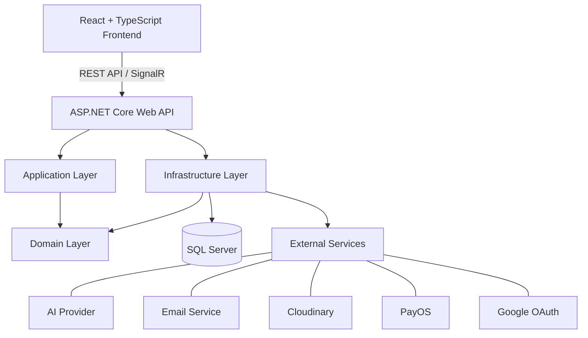

<div align="center">

# 🤖 AITasker

**AI Marketplace Platform for AI Automation Services**

A specialized freelance marketplace that connects Clients with AI Experts through AI-assisted job creation, intelligent matching, realtime collaboration, contracts, escrow payments, project delivery, and dispute resolution.

[Overview](#overview) · [Team](#project-team) · [Features](#core-features) · [Workflow](#business-workflow) · [Local Setup](#local-development) · [Deployment](#deployed-environment)

</div>

---

## 📌 Project Information

| | |
|---|---|
| **Course** | SWP391 — Software Development Project |
| **University** | FPT University |
| **Project** | AITasker — AI Marketplace Platform for AI Automation Services |
| **Team** | Team 5 |
| **Lecturer / Supervisor** | Tran Ngoc Nhu Quynh |
| **Repository** | [github.com/khoabuck/AI-Tasker](https://github.com/khoabuck/AI-Tasker) |

---

## 👥 Project Team

| Member | Primary Role | Contributions |
|---|---|---|
| **Phan Tiến Phát** | Project Lead · Backend Developer | 25% |
| **Đinh Đức Khoa** | Backend Developer | 25% |
| **Nguyễn Gia Huy** | Frontend Developer | 25% |
| **Nguyễn Hoàng Minh** | Frontend Developer | 25% |

> **📝 Note**
> Update the lecturer name and task descriptions according to the team's official assignment sheet before final submission.

---

## 📖 Overview

AITasker addresses a common problem in AI outsourcing: many Clients need AI solutions but struggle to define technical requirements, identify qualified Experts, and manage delivery and payment safely. At the same time, AI Experts need a specialized environment where their skills, portfolios, proposals, and project outcomes can be evaluated transparently.

The platform supports the complete service lifecycle:

```
Registration → Profile Completion → Job Creation → Expert Matching
     → Proposal → Negotiation → Contract → Escrow → Project Execution
     → Deliverable Review → Payment Release → Review
```

AITasker combines a traditional freelance workflow with AI-assisted requirement generation, profile evaluation, recommendation, realtime communication, milestone management, wallet and escrow processing, and administrative dispute resolution.

---

## ✨ Core Features

### 🔐 Authentication & Profiles
- Email/password registration and login
- Email verification and password recovery
- Google OAuth authentication
- JWT authentication with HttpOnly cookies
- Client and AI Expert profile workflows
- Individual and Business Client profiles
- Role-based authorization

### 🧠 AI-Assisted Experience
- AI Job Assistant
- Job title and description generation
- Budget and deliverable suggestions
- AI Expert profile evaluation
- Job–Expert recommendation
- Recommended jobs for Experts

### 🛒 Marketplace & Contract
- Job drafts and publishing
- Job posting and AI generation credits
- Proposal submission and management
- Realtime negotiation
- Contract creation from accepted proposals
- Dual contract confirmation

### 📦 Project Delivery
- Project and milestone tracking
- Deliverable submission and versioning
- Approval and revision requests
- Project chat and notifications
- Completion and review workflows

### 💰 Wallet, Payment & Escrow
- User wallet and transaction history
- Deposit order processing
- PayOS integration
- Escrow locking and release
- Platform fee calculation
- Refund and withdrawal handling

### 🛡️ Trust & Administration
- Dispute and evidence submission
- Admin resolution and reconciliation
- Client reviews and Expert ratings
- User, job, project, and review moderation
- Package and policy configuration
- Administrative dashboards and audit logs


---

## 🏗️ System Architecture

AITasker follows a layered architecture that separates domain rules, application contracts, infrastructure services, and API delivery.



### Backend Responsibilities

| Layer | Responsibility |
|---|---|
| **AITasker.Domain** | Core entities, enums, and domain concepts |
| **AITasker.Application** | DTOs, interfaces, validation contracts, and application abstractions |
| **AITasker.Infrastructure** | EF Core, business services, external integrations, storage, email, AI, payment, and repositories |
| **AITasker.Api** | Controllers, middleware, authentication, dependency injection, Swagger, and SignalR hubs |

---

## 🧰 Technology Stack

| Area | Technologies |
|---|---|
| **Frontend** | React 19, TypeScript 6, Vite 8, React Router, Axios, Tailwind CSS |
| **Backend** | ASP.NET Core 10, C# 14, Entity Framework Core 10, FluentValidation |
| **Authentication** | JWT Bearer, HttpOnly cookies, Google OAuth, BCrypt |
| **Realtime** | ASP.NET Core SignalR |
| **Database** | Microsoft SQL Server |
| **AI** | Groq-backed AI services configured by the backend |
| **Storage & Email** | Cloudinary, MailKit / external email provider |
| **Payment** | PayOS and VietQR-related verification flows |
| **API Documentation** | Swagger / OpenAPI |
| **Deployment** | Vercel, Docker, cloud-hosted ASP.NET Core, GitHub Actions |

---

## 📁 Repository Structure

```
AI-Tasker/
├── backend/
│   ├── AITasker.Api/             # API endpoints, middleware, auth, SignalR
│   ├── AITasker.Application/     # DTOs, interfaces, validation contracts
│   ├── AITasker.Domain/          # Domain entities and enums
│   ├── AITasker.Infrastructure/  # EF Core and external integrations
│   ├── AITasker.slnx
│   └── Dockerfile
├── frontend/
│   ├── public/
│   ├── src/
│   ├── package.json
│   ├── vite.config.ts
│   └── vercel.json
├── Document AiTasker/
├── .github/
└── README.md
```

---

## 👤 User Roles

| Role | Main Capabilities |
|---|---|
| **Guest** | View public information, register, and log in |
| **Individual Client** | Create jobs, hire Experts, sign contracts, fund escrow, approve deliverables, and submit reviews |
| **Business Client** | Use Client workflows with business verification and Business Client fee policies |
| **AI Expert** | Build a professional profile, browse jobs, submit proposals, deliver milestones, and receive earnings |
| **Administrator** | Moderate platform activity and manage users, jobs, projects, disputes, reviews, packages, and transactions |

---

## 💻 Local Development

Use this section when running the complete system on a local development machine.

### Prerequisites

- Git
- .NET 10 SDK
- Node.js 20 or later
- Microsoft SQL Server
- SQL Server Management Studio or another SQL client

### 1. Clone the Repository

```bash
git clone https://github.com/khoabuck/AI-Tasker.git
cd AI-Tasker
```

### 2. Configure the Backend

```bash
cd backend
dotnet restore
```

Configure development settings in `backend/AITasker.Api/appsettings.json` or through .NET user secrets/environment variables:

```json
{
  "ConnectionStrings": {
    "DefaultConnection": "Server=YOUR_SERVER;Database=AITaskerDb;User Id=YOUR_USER;Password=YOUR_PASSWORD;TrustServerCertificate=True;Encrypt=False"
  },
  "Jwt": {
    "Issuer": "AITasker",
    "Audience": "AITaskerClient",
    "Key": "YOUR_SECURE_JWT_KEY"
  },
  "Groq": {
    "ApiKey": "YOUR_GROQ_API_KEY"
  }
}
```

> **⚠️ Caution**
> Never commit real passwords, API keys, OAuth secrets, payment credentials, or production connection strings.

### 3. Apply Database Migrations

From the `backend` directory:

```bash
dotnet ef database update \
  --project AITasker.Infrastructure/AITasker.Infrastructure.csproj \
  --startup-project AITasker.Api/AITasker.Api.csproj
```

### 4. Run the Backend

```bash
dotnet run --project AITasker.Api/AITasker.Api.csproj
```

| Service | Local URL |
|---|---|
| Backend API | `http://localhost:5070` |
| Swagger | `http://localhost:5070/swagger` |

### 5. Configure and Run the Frontend

Open another terminal from the repository root:

```bash
cd frontend
npm install
```

Create or update `frontend/.env`:

```env
VITE_API_BASE_URL=http://localhost:5070
VITE_BACKEND_BASE_URL=http://localhost:5070
VITE_SIGNALR_URL=http://localhost:5070
```

Run the development server:

```bash
npm run dev
```

| Service | Local URL |
|---|---|
| Frontend | `http://localhost:5173` |
| Backend API | `http://localhost:5070` |
| Swagger | `http://localhost:5070/swagger` |
| Database | Local SQL Server instance |

### Useful Commands

```bash
# Backend build
dotnet build backend/AITasker.slnx

# Frontend lint
npm --prefix frontend run lint

# Frontend production build
npm --prefix frontend run build
```

---

## 🚀 Deployed Environment

Use this section for the online demonstration environment.

### Deployment Overview

| Component | Platform | Address |
|---|---|---|
| Frontend | Vercel | *[Add deployed frontend URL]* |
| Backend API | Cloud-hosted ASP.NET Core service | *[Add deployed backend URL]* |
| Swagger | Backend OpenAPI endpoint | *[Add deployed Swagger URL]* |
| Database | Cloud SQL Server | Private connection |
| File Storage | Cloudinary | Configured through secrets |
| Payment Webhook | PayOS | Configured backend endpoint |

### Frontend Deployment

Recommended Vercel settings:

| Setting | Value |
|---|---|
| Root Directory | `frontend` |
| Install Command | `npm install` |
| Build Command | `npm run build` |
| Output Directory | `dist` |

Production environment variables:

```env
VITE_API_BASE_URL=https://your-backend-domain
VITE_BACKEND_BASE_URL=https://your-backend-domain
VITE_SIGNALR_URL=https://your-backend-domain
```

### Backend Deployment

Create a release artifact:

```bash
dotnet publish backend/AITasker.Api/AITasker.Api.csproj \
  --configuration Release \
  --output ./publish
```

The repository also contains a backend `Dockerfile` for container-based deployment.

Common production settings include:

```
ConnectionStrings__DefaultConnection
Jwt__Issuer
Jwt__Audience
Jwt__Key
Groq__ApiKey
Google__ClientId
Google__ClientSecret
Cloudinary__CloudName
Cloudinary__ApiKey
Cloudinary__ApiSecret
PayOS__ClientId
PayOS__ApiKey
PayOS__ChecksumKey
```

### Deployment Checklist

- [ ] Configure HTTPS and the production domain
- [ ] Configure CORS for the deployed frontend
- [ ] Apply database migrations
- [ ] Configure Google OAuth callback URLs
- [ ] Configure PayOS return, cancel, and webhook URLs
- [ ] Configure SignalR to use the deployed backend
- [ ] Store all credentials in environment variables or a secret manager
- [ ] Verify registration, login, AI requests, chat, payment, and upload flows
- [ ] Disable or restrict Swagger in production when required

---

## 📚 API Documentation

Swagger is available in the local environment at:

```
http://localhost:5070/swagger
```

Major API groups include:

```
/api/auth                 /api/jobs
/api/users                /api/proposals
/api/client-profiles      /api/contracts
/api/expert-profiles      /api/projects
/api/conversations        /api/milestones
/api/deliverables         /api/wallets
/api/payments             /api/disputes
/api/reviews              /api/admin
```

---

## 📊 Project Status

AITasker is developed as an academic software project for SWP391. The repository demonstrates an end-to-end AI freelance marketplace workflow and is intended for learning, assessment, and project demonstration purposes.

---

## 📄 License

This project is provided for educational and academic use as part of the SWP391 Software Development Project at FPT University.

<div align="center">

**Developed with dedication by AITasker Team 5**

</div>
